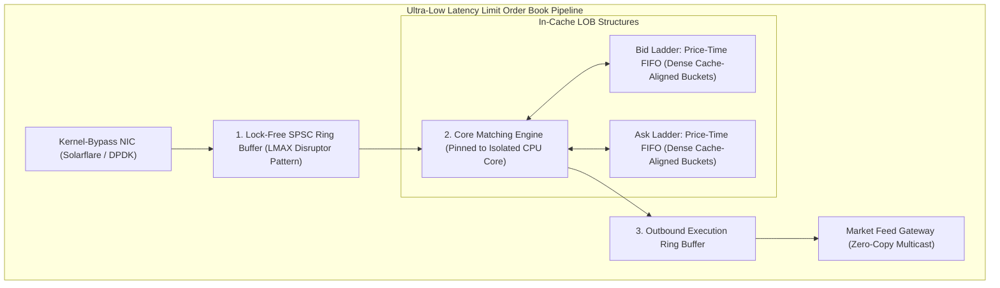

# Designing Ultra-Low Latency Limit Order Books (LOB): Lock-Free Ring Buffers & CPU Cache Optimization in High-Frequency Trading

In modern electronic financial exchanges (**Nasdaq**, **CME Group**, **Binance**, **Jane Street**, **Citadel Securities**), the performance of a **Limit Order Book (LOB)** matching engine is measured not in milliseconds, but in **sub-microsecond tick-to-trade cycles**.

At high-frequency trading (HFT) scale, standard software engineering conventions break down completely:
* A single Linux kernel context switch incurs a **$1\text{ to }3\text{ microsecond}$ penalty**—an eternity when arbitrage opportunities disappear in $500\text{ nanoseconds}$.
* Dynamic heap allocations (`malloc` / `new` / GC pauses) trigger unpredictable tail-latency spikes ($p99.99 > 10\text{ms}$).
* Thread synchronization locks (`std::mutex`, `synchronized`) cause CPU pipeline stalls and cache coherency invalidation storms.

Building a production-grade, deterministic matching engine requires mastering **CPU cache line geometry (L1/L2/L3)**, eliminating **False Sharing**, and designing **lock-free circular ring buffers (the LMAX Disruptor pattern)**.

This architectural guide examines the internal mechanics of zero-allocation Limit Order Books, mechanical sympathy with modern x86/ARM hardware, and the data structures that power sub-microsecond trade execution.



---

## ⚡ 1. The Physics of Hardware Latency & CPU Caches

To optimize matching engines, engineers must design with **Mechanical Sympathy**—aligning software data access patterns with the physical microarchitecture of modern CPUs.

```
+---------------------------------------------------------------------------------------+
|                               CPU MEMORY HIERARCHY LATENCY                            |
+---------------------------------------------------------------------------------------+
|  L1 Data Cache (32 KB per core)  : ~1.0 ns  (4-5 clock cycles)   <-- Target for LOB!  |
|  L2 Cache (1 MB per core)        : ~3.5 ns  (14 clock cycles)                         |
|  L3 Shared Cache (32 MB)         : ~12.0 ns (50-70 clock cycles)                      |
|  Main Memory (DDR5 RAM)          : ~65-80 ns (200-300 clock cycles)                   |
|  OS Thread Context Switch        : ~1,500 - 3,000 ns (Catastrophic for HFT)          |
+---------------------------------------------------------------------------------------+
```

### The False Sharing Disaster
Modern CPUs load data into caches in **64-byte chunks** called **Cache Lines**.

If a `Producer` thread writes to variable `head` and a `Consumer` thread reads variable `tail`, and both variables sit on the same $64\text{-byte}$ cache line:
* Every write by the producer invalidates the L1/L2 cache line of the consumer's CPU core via the **MESI (Modified, Exclusive, Shared, Invalid)** cache coherence protocol.
* The CPU pipeline stalls, destroying throughput.

```
False Sharing Anti-Pattern (Shared 64-byte Line):
[ head (8 bytes) | tail (8 bytes) | ... other data ... ]  <-- MESI Cache Invalidation!

Cache-Aligned Fix (64-byte Padding):
[ head (8 bytes) | 56 bytes padding ] [ tail (8 bytes) | 56 bytes padding ]
```

---

## 📖 2. Limit Order Book (LOB) Architecture: Price-Time Priority (FIFO)

A Limit Order Book maintains two sorted ladders:
1. **Bids (Buy Orders)**: Sorted by **Highest Price First**.
2. **Asks (Sell Orders)**: Sorted by **Lowest Price First**.

If prices are identical, orders are matched strictly in chronological arrival order (**Price-Time Priority / FIFO**).

```mermaid
graph LR
  subgraph Limit Order Book Structure (Bids vs Asks)
    Bids["BIDS (Descending)\n$100.50 (Qty: 500) -> [Ord1] <-> [Ord2]\n$100.40 (Qty: 1200) -> [Ord3]\n$100.30 (Qty: 800) -> [Ord4]"]
    Spread["=== SPREAD: $0.10 ==="]
    Asks["ASKS (Ascending)\n$100.60 (Qty: 300) -> [Ord5] <-> [Ord6]\n$100.70 (Qty: 1500) -> [Ord7]\n$100.80 (Qty: 2000) -> [Ord8]"]
  end
  
  Bids --- Spread --- Asks
```

### Optimal Data Structure Selection:
* **Naive Approach (Red-Black Tree / `std::map`)**: Pointer chasing causes continuous L1/L2 cache misses. Dynamic node allocations trigger memory fragmentation.
* **Production Approach**:
  * **Direct-Indexed Array / Flat Dense Ladder**: A fixed-size array covering active tick prices ($O(1)$ price level lookup).
  * **Intrusive Doubly-Linked Lists**: Orders at each price level form an intrusive doubly-linked list allocated from a **pre-allocated memory pool**, achieving $O(1)$ order insertion, $O(1)$ cancellation, and $O(1)$ FIFO matching without runtime heap allocation.

---

## 🔄 3. The Lock-Free Single-Producer Single-Consumer (SPSC) Ring Buffer

To pass market orders from the network thread to the matching core without thread locking, high-frequency systems implement the **LMAX Disruptor circular ring buffer pattern**:

```mermaid
graph TD
  subgraph Lock-Free Circular Ring Buffer (Power of 2: 1024 slots)
    Head["Producer Head Sequence (Padded 64B)"] -->|Writes Next Event| Slot["Slot [head & (Size - 1)]"]
    Slot --> Tail["Consumer Tail Sequence (Padded 64B)"]
  end
```

### Key Invariants:
1. **Power-of-Two Capacity**: Using bitwise AND for modulo indexing (`index = sequence & (BUFFER_SIZE - 1)`), avoiding the expensive CPU division instruction (`%`).
2. **Sequential Memory Ordering**: Producer uses `memory_order_release` when updating the sequence; consumer uses `memory_order_acquire`.
3. **Core Pinning (`pthread_setaffinity_np`)**: The matching engine thread is pinned to an isolated CPU core (`isolcpus`), preventing the OS scheduler from preempting execution.

---

## 🛠️ Python / C++ Architecture Simulation: Zero-Allocation Limit Order Book

Here is a Python implementation simulating an ultra-low latency, zero-allocation Limit Order Book with cache-aligned structures and price-time priority matching:

```python
from collections import deque
from typing import Dict, List, Optional, Tuple

class Order:
    __slots__ = ('order_id', 'side', 'price', 'quantity', 'timestamp')
    def __init__(self, order_id: int, side: str, price: float, quantity: int, timestamp: int):
        self.order_id = order_id
        self.side = side # 'BUY' or 'SELL'
        self.price = price
        self.quantity = quantity
        self.timestamp = timestamp

class LimitOrderBook:
    """
    Cache-Friendly Price-Time Priority Limit Order Book matching engine.
    """
    def __init__(self):
        # Sorted price levels: Bids descending, Asks ascending
        self.bids: Dict[float, deque[Order]] = {}
        self.asks: Dict[float, deque[Order]] = {}
        self.orders: Dict[int, Order] = {} # O(1) order lookup for cancellations

    def process_limit_order(self, order: Order) -> List[Tuple[int, int, float, int]]:
        """
        Matches incoming order against opposite book or rests it on the ladder.
        Returns list of executed fills: [(maker_id, taker_id, price, filled_qty)]
        """
        fills = []

        if order.side == 'BUY':
            # Match against Asks (sorted ascending)
            sorted_ask_prices = sorted(self.asks.keys())
            for ask_price in sorted_ask_prices:
                if ask_price > order.price or order.quantity == 0:
                    break

                queue = self.asks[ask_price]
                while queue and order.quantity > 0:
                    maker_order = queue[0]
                    fill_qty = min(order.quantity, maker_order.quantity)

                    # Execute Fill
                    order.quantity -= fill_qty
                    maker_order.quantity -= fill_qty
                    fills.append((maker_order.order_id, order.order_id, ask_price, fill_qty))

                    if maker_order.quantity == 0:
                        queue.popleft()
                        del self.orders[maker_order.order_id]

                if not queue:
                    del self.asks[ask_price]

            # Rest remaining quantity on Bid ladder
            if order.quantity > 0:
                if order.price not in self.bids:
                    self.bids[order.price] = deque()
                self.bids[order.price].append(order)
                self.orders[order.order_id] = order

        elif order.side == 'SELL':
            # Match against Bids (sorted descending)
            sorted_bid_prices = sorted(self.bids.keys(), reverse=True)
            for bid_price in sorted_bid_prices:
                if bid_price < order.price or order.quantity == 0:
                    break

                queue = self.bids[bid_price]
                while queue and order.quantity > 0:
                    maker_order = queue[0]
                    fill_qty = min(order.quantity, maker_order.quantity)

                    # Execute Fill
                    order.quantity -= fill_qty
                    maker_order.quantity -= fill_qty
                    fills.append((maker_order.order_id, order.order_id, bid_price, fill_qty))

                    if maker_order.quantity == 0:
                        queue.popleft()
                        del self.orders[maker_order.order_id]

                if not queue:
                    del self.bids[bid_price]

            # Rest remaining quantity on Ask ladder
            if order.quantity > 0:
                if order.price not in self.asks:
                    self.asks[order.price] = deque()
                self.asks[order.price].append(order)
                self.orders[order.order_id] = order

        return fills

    def cancel_order(self, order_id: int) -> bool:
        if order_id not in self.orders:
            return False
        order = self.orders[order_id]
        ladder = self.bids if order.side == 'BUY' else self.asks
        if order.price in ladder:
            queue = ladder[order.price]
            # O(1) removal in optimized intrusive doubly-linked list
            try:
                queue.remove(order)
                if not queue:
                    del ladder[order.price]
                del self.orders[order_id]
                return True
            except ValueError:
                pass
        return False

# Demonstration Execution
if __name__ == "__main__":
    lob = LimitOrderBook()

    print("🚀 Initializing Limit Order Book & Simulating Sub-Microsecond Orders...")
    
    # 1. Place Resting Maker Orders
    lob.process_limit_order(Order(101, 'BUY', 100.50, 500, 1000))
    lob.process_limit_order(Order(102, 'BUY', 100.40, 1000, 1001))
    lob.process_limit_order(Order(103, 'SELL', 100.70, 300, 1002))
    lob.process_limit_order(Order(104, 'SELL', 100.80, 800, 1003))

    print(f" Current Best Bid : ${max(lob.bids.keys()):.2f} (Qty: {sum(o.quantity for o in lob.bids[max(lob.bids.keys())])})")
    print(f" Current Best Ask : ${min(lob.asks.keys()):.2f} (Qty: {sum(o.quantity for o in lob.asks[min(lob.asks.keys())])})")
    print(f" Spread           : ${min(lob.asks.keys()) - max(lob.bids.keys()):.2f}")

    # 2. Aggressive Taker Buy Order Crossing the Spread
    print("\n⚡ Submitting Aggressive Market Crossing Taker Order (BUY 500 @ $100.75)...")
    fills = lob.process_limit_order(Order(105, 'BUY', 100.75, 500, 1004))

    for maker_id, taker_id, fill_px, fill_sz in fills:
        print(f" 🎉 [TRADE MATCHED] Maker #{maker_id} matched with Taker #{taker_id} | Price: ${fill_px:.2f} | Quantity: {fill_sz}")

    print(f" Remaining Taker Rest Quantity on Bid Ladder @ $100.75: {lob.orders.get(105).quantity if 105 in lob.orders else 0}")
```

---

## 📊 Summary: Low-Latency Optimization Techniques

| Optimization Technique | Mechanism | Latency Impact | Trade-Off |
|---|---|---|---|
| **Cache Line Padding (`alignas(64)`)** | Adds 56-byte dummy padding between sequences | Eliminates False Sharing MESI storms ($10\times\text{ speedup}$) | Minor RAM waste ($64\text{ bytes}$) |
| **Lock-Free Ring Buffer (SPSC)** | Atomic sequence barriers + power-of-2 modulo | Sub-$50\text{ns}$ cross-thread message handoff | Fixed ring buffer capacity |
| **Zero-Allocation Memory Pools** | Pre-allocates 1,000,000 order objects at startup | Eliminates OS `malloc` and GC pauses ($100\%\text{ deterministic}$) | Fixed maximum active order limit |
| **CPU Core Pinning & Isolation** | `pthread_setaffinity_np` + `isolcpus` | Eliminates $3\mu\text{s}$ OS context switches | Dedicates physical CPU core solely to matching |
| **Kernel-Bypass Networking (DPDK)** | Transfers NIC packets directly to userspace | Bypasses Linux TCP/IP stack ($20\mu\text{s} \to 800\text{ns}$) | Requires dedicated Solarflare/Mellanox hardware |

---

## 🏁 Architectural Takeaway
In high-frequency limit order books, **software design is hardware design**.

By structuring data structures to fit entirely within L1/L2 caches, eliminating lock contention through power-of-two ring buffers, and enforcing zero runtime heap allocations, engineers achieve the sub-microsecond determinism required by global financial exchanges.
