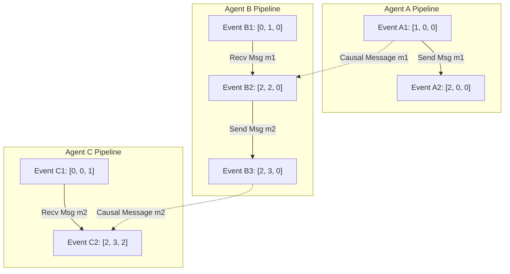

# Vector Clocks & Logical Time in Asynchronous Multi-Agent Trajectories

In distributed multi-agent systems, agents operate across different physical servers, message brokers, and execution environments. Relying on physical wall-clock timestamps (like system clock time) to order event trajectories is dangerous due to **clock skew** and network latency jitter. Two messages sent sequentially may arrive at a central server with inverted physical timestamps.

To establish true **causal order** without relying on synchronized physical clocks, systems engineers deploy **Logical Time** mechanisms—specifically **Vector Clocks**.

Vector clocks track the exact causal relationship between events: determining whether Event $A$ happened before Event $B$ ($A → B$), or whether Event $A$ and Event $B$ occurred concurrently ($A \parallel B$).

This article details how to construct a Vector Clock tracking engine for asynchronous multi-agent execution trajectories.

---

## Causal Time & Vector Clock Architecture

Vector timestamp progression and concurrency detection across three agent nodes:



### Vector Clock Updating Rules
For a cluster of $N$ agent processes, each agent $i$ maintains a clock vector $V_i$ of size $N$, initialized to all zeros:
1. **Local Event Rule**: Before agent $i$ executes a local operation or sends a message, it increments its own logical index:
   $$V_i[i] = V_i[i] + 1$$
2. **Message Send Rule**: Agent $i$ attaches its updated vector timestamp $V_i$ to every outgoing message.
3. **Message Receive Rule**: When agent $j$ receives a message containing vector $V_{\text{msg}}$, it updates each element to the element-wise maximum and increments its own clock index:
   $$V_j[k] = \max(V_j[k], V_{\text{msg}}[k]) \quad \forall k \in [1, N]$$
   $$V_j[j] = V_j[j] + 1$$

---

## Python Implementation: Multi-Agent Vector Clock Engine

Here is a production-grade Python implementation of a Vector Clock engine tracking causal dependencies and detecting concurrent execution conflicts between 3 asynchronous agent workers:

```python
from typing import List, Dict, Tuple, Optional
from pydantic import BaseModel, Field

class VectorClock(BaseModel):
    clock: Dict[str, int] = Field(default_factory=dict)

    def increment(self, node_id: str):
        """Increments the local clock counter for this node."""
        self.clock[node_id] = self.clock.get(node_id, 0) + 1

    def update_on_receive(self, node_id: str, incoming_clock: 'VectorClock'):
        """Performs element-wise max merge and increments local clock."""
        all_keys = set(self.clock.keys()).union(set(incoming_clock.clock.keys()))
        for key in all_keys:
            self.clock[key] = max(self.clock.get(key, 0), incoming_clock.clock.get(key, 0))
        self.increment(node_id)

    def compare(self, other: 'VectorClock') -> str:
        """
        Compares two vector clocks to determine causal relationship.
        Returns: 'BEFORE' (self -> other), 'AFTER' (other -> self), or 'CONCURRENT' (self || other).
        """
        all_keys = set(self.clock.keys()).union(set(other.clock.keys()))
        self_less_or_equal = True
        self_greater_or_equal = True

        for key in all_keys:
            v_self = self.clock.get(key, 0)
            v_other = other.clock.get(key, 0)
            if v_self > v_other:
                self_less_or_equal = False
            if v_self < v_other:
                self_greater_or_equal = False

        if self_less_or_equal and not self_greater_or_equal:
            return "BEFORE"
        elif self_greater_or_equal and not self_less_or_equal:
            return "AFTER"
        elif self_less_or_equal and self_greater_or_equal:
            return "EQUAL"
        else:
            return "CONCURRENT"

class AgentProcess:
    def __init__(self, agent_id: str, cluster_agents: List[str]):
        self.agent_id = agent_id
        self.vclock = VectorClock(clock={aid: 0 for aid in cluster_agents})
        self.event_log: List[Tuple[str, VectorClock]] = []

    def execute_local_task(self, task_name: str):
        """Executes a local task step and increments vector clock."""
        self.vclock.increment(self.agent_id)
        current_state = VectorClock(clock=dict(self.vclock.clock))
        self.event_log.append((task_name, current_state))
        print(f" ⚙️ [{self.agent_id}] Executed '{task_name}' -> Clock: {current_state.clock}")

    def send_message(self, task_name: str) -> VectorClock:
        """Increments clock and exports vector timestamp for message payload."""
        self.vclock.increment(self.agent_id)
        current_state = VectorClock(clock=dict(self.vclock.clock))
        self.event_log.append((f"Send: {task_name}", current_state))
        print(f" 📤 [{self.agent_id}] Sent Message '{task_name}' -> Clock: {current_state.clock}")
        return current_state

    def receive_message(self, task_name: str, incoming_clock: VectorClock):
        """Processes incoming vector clock and updates local trajectory."""
        self.vclock.update_on_receive(self.agent_id, incoming_clock)
        current_state = VectorClock(clock=dict(self.vclock.clock))
        self.event_log.append((f"Recv: {task_name}", current_state))
        print(f" 📥 [{self.agent_id}] Received '{task_name}' -> Clock: {current_state.clock}")

# Demonstration Execution
if __name__ == "__main__":
    cluster = ["agent-A", "agent-B", "agent-C"]
    agent_a = AgentProcess("agent-A", cluster)
    agent_b = AgentProcess("agent-B", cluster)
    agent_c = AgentProcess("agent-C", cluster)

    print("🚀 Demonstrating Vector Clock Causal Tracking...")
    print("=" * 75)

    # 1. Agent A executes task & sends message to Agent B
    agent_a.execute_local_task("Fetch Prompts")
    msg_clock_1 = agent_a.send_message("Pass Context to B")

    # 2. Agent B receives message & does work
    agent_b.receive_message("Pass Context to B", msg_clock_1)
    agent_b.execute_local_task("Generate LLM Code")

    # 3. Agent C executes concurrent work independently
    agent_c.execute_local_task("Background DB Cleanup")

    # Compare Clocks between Agent B's LLM generation and Agent C's DB cleanup
    clock_b_gen = agent_b.event_log[-1][1]
    clock_c_clean = agent_c.event_log[-1][1]

    relationship = clock_b_gen.compare(clock_c_clean)
    print("\n🔍 Causal Analysis between Agent B (LLM Gen) and Agent C (DB Clean):")
    print(f" Agent B Clock: {clock_b_gen.clock}")
    print(f" Agent C Clock: {clock_c_clean.clock}")
    print(f" Result      : Causal Relationship is {relationship}")
```

---

## Vector Clock Gotchas & Mitigation

When implementing vector clocks in large swarms:

> [!IMPORTANT]
> **Watch for Vector Size Overhead in Dynamic Clusters**: In clusters with thousands of dynamically spawning ephemeral agents, storing a vector entry per agent ID causes timestamp header size bloat. Deploy **Dotted Version Vectors** or **Interval Tree Clocks** to keep vector sizes fixed.

> [!CAUTION]
> **Handle Concurrent Conflicts Explicitly**: When a vector comparison returns `CONCURRENT`, neither event caused the other. The application must invoke deterministic conflict resolution logic (such as CRDT merge rules or Last-Write-Wins timestamps) to reconcile state.

---

## Real-World Enterprise Impact
Teams building vector clock tracking report:
* **Zero Out-of-Order Execution Bugs**: Trajectories are strictly ordered according to true causality, regardless of physical network delay.
* **Instant Concurrency Detection**: Identifying concurrent execution branches allows swarms to execute parallel task branches safely without state corruption.
