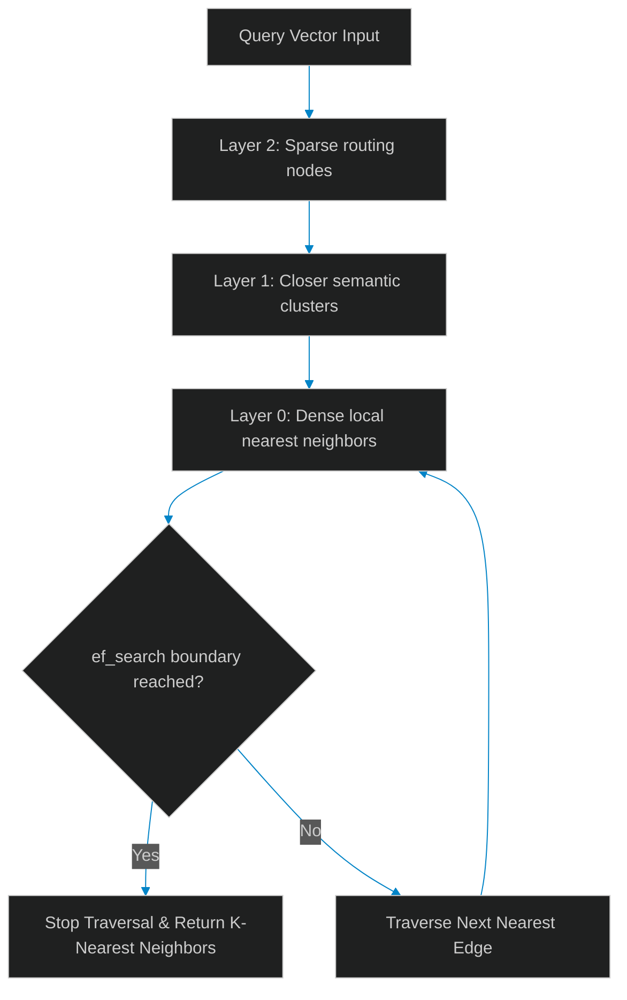

# HNSW Index Tuning: Optimizing Recall vs. Latency in pgvector and Qdrant

> [!NOTE]
> **📖 Article Overview**
> As vector databases (like `pgvector`, Qdrant, or Pinecone) scale to store millions of document embeddings, query latencies can degrade rapidly. If a multi-agent RAG workflow relies on slow similarity searches, response times slow down, rendering the system unusable. To restore performance, engineers must construct **Hierarchical Navigable Small World (HNSW)** index graphs. However, HNSW graphs present a critical trade-off: **Recall accuracy vs. Search latency**. In this article, we analyze HNSW graph structures, configure index tuning parameters, and implement a graph search-path simulator in Python.

---

## The HNSW Index Trade-Off

Unlike flat index vectors that run complete linear scans (exact search), HNSW builds a multi-layer graph of document nodes:
* **The Layered Graph Structure**: Top layers have fewer links, enabling fast routing across distant semantic concepts. Bottom layers have dense links, enabling fine-grained local similarity scans.
* **Tuning Parameters**:
    * **`M`**: The maximum number of connection links per node. Higher `M` improves recall on high-dimensional vectors but increases index build times and memory footprints.
    * **`ef_construction`**: The size of the dynamic candidate list evaluated during index creation. Higher `ef_construction` builds a more accurate graph but increases indexing times.
    * **`ef_search`**: The size of the candidate list evaluated during query execution. Higher `ef_search` increases recall accuracy at the cost of higher query latencies.



---

## 1. Tuning Index Parameters in Production

For enterprise agent systems, customize your index parameters:
* **For High-Recall RAG (QA / Code Audit)**: Set `M = 32`, `ef_construction = 128`, and `ef_search = 64`. This configuration ensures that critical document targets are not missed during retrieval.
* **For Latency-Critical swarms (Chatbots / Classification)**: Set `M = 16`, `ef_construction = 64`, and `ef_search = 32` to speed up query execution.

---

## 2. Managing write-heavy indexes

Building HNSW graphs concurrently consumes substantial CPU resources:
1. **Defer Index Creation**: Bulk-insert raw document vectors first, then build the HNSW index concurrently.
2. **Configure Memory Allocations**: In PostgreSQL, allocate sufficient `max_parallel_workers` and `maintenance_work_mem` resources before running `CREATE INDEX` queries.

---

## Code Demo: HNSW Search-Path Simulator

Below is a Python implementation of an HNSW graph traversal simulator. It models search paths across a multi-tier node structure, measures traversal steps, and benchmarks latency/recall trade-offs based on candidate thresholds.

```python
import math
from typing import List, Dict, Tuple

class HNSWGraphSimulator:
    def __init__(self):
        # Simulated multi-layer graph nodes representing semantic concepts
        # Structure: Layer 2 -> Layer 1 -> Layer 0 (Detailed chunks)
        self.layers = {
            2: {"A": [1.0, 1.0], "B": [-1.0, -1.0]},
            1: {"A1": [1.0, 0.8], "A2": [0.8, 1.0], "B1": [-1.0, -0.8]},
            0: {"A1a": [1.0, 0.79], "A1b": [0.98, 0.82], "B1a": [-0.99, -0.78]}
        }

    def _distance(self, v1: List[float], v2: List[float]) -> float:
        return math.sqrt(sum((x - y) ** 2 for x, y in zip(v1, v2)))

    def simulate_search(self, query: List[float], ef_search: int) -> Tuple[str, int]:
        steps = 0
        current_node = "A" # Start node at Layer 2
        
        # Traverse down layers
        for layer_idx in [2, 1, 0]:
            layer_nodes = self.layers[layer_idx]
            best_dist = float("inf")
            best_node = current_node

            # Scan adjacent nodes in active layer
            # Simulating search candidate limit: ef_search bounds execution steps
            for node, coords in list(layer_nodes.items())[:ef_search]:
                steps += 1
                dist = self._distance(query, coords)
                if dist < best_dist:
                    best_dist = dist
                    best_node = node
            
            current_node = best_node

        return current_node, steps

if __name__ == "__main__":
    simulator = HNSWGraphSimulator()
    query_vector = [0.99, 0.80] # Target close to A1a

    print("🛰️ Simulating HNSW Graph Traversal Search...")
    print("---------------------------------------------")

    # Run with small ef_search (low latency, lower accuracy potential)
    node_low, steps_low = simulator.simulate_search(query_vector, ef_search=1)
    print(f"[Low Latency] ef_search = 1 | Traversal Steps: {steps_low} | Match Node: **{node_low}**")

    # Run with larger ef_search (high latency, high accuracy potential)
    node_high, steps_high = simulator.simulate_search(query_vector, ef_search=3)
    print(f"[High Recall]  ef_search = 3 | Traversal Steps: {steps_high} | Match Node: **{node_high}**")
```

---

## Architectural Guidelines

* **Customize ef_search**: Set `ef_search` dynamically on a per-request basis. Increase the search window for code audits, and reduce it for rapid chat classifications.
* **Build Concurrently**: Defer index creation until after bulk-insert runs are complete, using concurrent worker options.
* **Monitor Recall Rates**: Periodically benchmark index queries against exact flat-index lookups to verify accuracy is not drifting.
