# Hybrid Index Traversal: Pre-Filtering vs. Post-Filtering in pgvector and Qdrant

In production Retrieval-Augmented Generation (RAG) systems, vector similarity queries are rarely executed in isolation [1]. Most enterprise applications require queries constrained by strict metadata filters, such as:
* *Locating document chunks matching a user query* **AND** *belonging strictly to `tenant_id = 45`*.
* *Finding customer support logs from the last 30 days* **AND** *tagged with `status = 'critical'`*.

Integrating traditional relational filtering (metadata) with Approximate Nearest Neighbor (ANN) vector search is a challenging engineering problem. This article compares **Post-Filtering**, **Pre-Filtering**, and **In-Graph (Single-Stage) Filtering**, demonstrating how to execute optimized hybrid searches in **pgvector** and **Qdrant**.

---

## The Three Filtering Paradigms

```mermaid
flowchart TD
  subgraph SG1_PostFiltering ["Post-Filtering"]
    A["HNSW Vector Search"] -->|Get top 100| B["Filter out non-matching metadata"]
    B -->|Problem - Result set collapses| C["Return remaining 2-3 items"]
  end
  subgraph SG2_PreFiltering ["Pre-Filtering"]
    D["Relational Metadata Scan"] -->|Isolate IDs| E["Flat Vector Search on subset"]
    E -->|Problem - Slow for large subsets| F["Return top 10 items"]
  end
  subgraph SG3_InGraphFiltering ["In-Graph Filtering Single-Stage"]
    G["HNSW Graph Traversal"] -->|Evaluate metadata on graph hops| H["Only route through matching nodes"]
    H -->|Optimal - Fast & complete| I["Return top 10 matching items"]
  end

classDef green fill:#dcfce7,stroke:#16a34a,stroke-width:2px,color:#14532d;
classDef red fill:#fee2e2,stroke:#dc2626,stroke-width:2px,color:#7f1d1d;
classDef blue fill:#e0f2fe,stroke:#0284c7,stroke-width:2px,color:#0c4a6e;
classDef yellow fill:#fef3c7,stroke:#d97706,stroke-width:2px,color:#78350f;
classDef purple fill:#ede9fe,stroke:#7c3aed,stroke-width:2px,color:#4c1d95;
class A,F blue
class B,G green
class C,H purple
class D,I yellow
class E red
```



### 1. Post-Filtering
In Post-Filtering, the database executes a standard HNSW vector search first, retrieves the top $K$ results (e.g. $K=100$), and then discards any items that do not match the metadata filter.
* **The Problem (Recall Collapse)**: If the metadata filter is highly restrictive (e.g. matches only 1% of your database), almost all of the top 100 items will be discarded. The client receives an incomplete or empty result set, even though matching documents exist in the database.

### 2. Pre-Filtering
Pre-Filtering executes the metadata scan first (e.g. using a relational B-Tree index) to isolate all matching document IDs, and then performs a vector similarity search across that subset.
* **The Problem (Latency Scaling)**: If the metadata filter matches a large subset (e.g. 500,000 documents), the database must perform a brute-force vector search across the entire subset because the pre-built HNSW graph index cannot be traversed for arbitrary sub-segments. Latency degrades to hundreds of milliseconds.

### 3. In-Graph (Single-Stage) Filtering
Single-stage filtering evaluates metadata constraints directly during the HNSW graph traversal. When the query router hops from node to node, it checks the node's metadata payload. If the metadata does not match, the router ignores the link and routes only through nodes that satisfy the criteria.
* **The Benefit**: It guarantees both **sub-10ms latency** and **100% accurate recall** by keeping the graph traversal active only on valid nodes.

---

## Implementing In-Graph Filtering

### 1. Single-Stage Filtering in Qdrant
Qdrant is built from the ground up to handle in-graph filtering natively. When you submit a filter object alongside your vector query, Qdrant's query engine dynamically decides whether to use a pre-filter scan or an in-graph HNSW traversal depending on the metadata cardinality.

Here is a production query payload executing an in-graph filter:

```json
{
  "vector": [0.015, -0.024, 0.087],
  "filter": {
    "must": [
      {
        "key": "tenant_id",
        "match": {
          "value": "tenant-abcd-1234"
        }
      },
      {
        "key": "category",
        "match": {
          "value": "legal_contracts"
        }
      }
    ]
  },
  "limit": 5,
  "params": {
    "hnsw_ef": 64
  }
}
```

### 2. Hybrid Querying in pgvector (PostgreSQL)
In PostgreSQL, pgvector version 0.5+ supports HNSW index scans combined with standard `WHERE` filters. To optimize this, ensure you have both the HNSW index on the vector column and standard B-Tree indexes on your metadata columns:

```sql
-- 1. Create indexes
CREATE INDEX CONCURRENTLY idx_docs_tenant ON documents (tenant_id);
CREATE INDEX CONCURRENTLY idx_docs_hnsw ON documents USING hnsw (embedding vector_cosine_ops);

-- 2. Execute hybrid query
-- PostgreSQL planner dynamically combines B-Tree scans and HNSW graph filters
EXPLAIN ANALYZE
SELECT id, content, tenant_id
FROM documents
WHERE tenant_id = 'tenant-abcd-1234'
ORDER BY embedding <=> '[0.015, -0.024, 0.087]'
LIMIT 5;
```

---

## Important Pitfalls in Hybrid Search

Avoid these common index performance traps:

> [!IMPORTANT]
> **Payload Size Inflation**: Storing massive metadata objects (e.g. full raw JSON documents) inside your vector database segments can bloat the graph files, causing them to exceed memory limits. Store only lightweight index columns (IDs, categories, status flags) in the vector DB, fetching the full body payloads from your primary relational database (PostgreSQL/MongoDB) using the returned IDs.

> [!CAUTION]
> **Index Building Order**: Always create your metadata indexes *before* generating HNSW indexes on large tables. If pgvector cannot find a metadata index, it may default to a sequential table scan, bypassing the HNSW graph entirely. [2]

## References & Further Reading

1. **Malkov, Y. A., & Yashunin, D. A. (2018)**. *Efficient and Robust Approximate Nearest Neighbor Search Using Hierarchical Navigable Small World Graphs*. IEEE TPAMI. [https://arxiv.org/abs/1603.09320](https://arxiv.org/abs/1603.09320)
2. **Jégou, H., Douze, M., & Schmid, C. (2011)**. *Product Quantization for Nearest Neighbor Search*. IEEE TPAMI. [https://hal.inria.fr/inria-00514462v2/document](https://hal.inria.fr/inria-00514462v2/document)
3. **Johnson, J., Douze, M., & Jégou, H. (2019)**. *Billion-scale Similarity Search with GPUs*. IEEE Transactions on Big Data. [https://arxiv.org/abs/1702.08734](https://arxiv.org/abs/1702.08734)
4. **pgvector Authors (2024)**. *pgvector: Open-source vector similarity search for Postgres*. GitHub. [https://github.com/pgvector/pgvector](https://github.com/pgvector/pgvector)
5. **PostgreSQL Global Development Group (2024)**. *PostgreSQL Documentation*. postgresql.org. [https://www.postgresql.org/docs/current/](https://www.postgresql.org/docs/current/)
6. **Vercel Engineering (2025)**. *Next.js 16*. Next.js Blog. [https://nextjs.org/blog/next-16](https://nextjs.org/blog/next-16)
7. **Vercel Engineering (2024)**. *Next.js 15*. Next.js Blog. [https://nextjs.org/blog/next-15](https://nextjs.org/blog/next-15)
