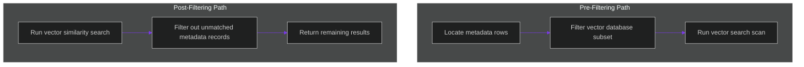

# Metadata Filtering Bottlenecks: Optimizing Pre-Filtering vs. Post-Filtering

> [!NOTE]
> **📖 Article Overview**
> Combining vector similarity searches with metadata filter variables (such as checking `status = 'active'` or `date > '2026-01-01'`) is standard in RAG setups. However, if not configured correctly, composite queries trigger massive query execution bottlenecks. In this article, we analyze the performance difference between **Pre-Filtering** and **Post-Filtering** query plans, map execution plan bottlenecks in pgvector, and implement a query path selector in Python.

---

## Lexical vs. Semantic Intersection Bottlenecks

When executing a vector query with metadata constraints:
* **The Post-Filtering Problem**: The database first performs an HNSW vector similarity search to find the top $K$ nearest neighbor nodes. It then filters out any results that do not match the metadata criteria. If only a few matches fit the criteria, the query returns very few results (reducing recall).
* **The Pre-Filtering Problem**: The database first locates all rows that match the metadata filter criteria, then executes a vector similarity scan on this subset. If the matching subset contains millions of rows, the index is ignored, falling back to a slow linear scan.
* **The Solution**: **Single-Stage Filtering (Iterative HNSW)**. Modern vector databases traverse HNSW graph edges while evaluating metadata filters concurrently, or dynamically choose between pre-filtering and post-filtering based on database statistics.



---

## 1. Under the Hood: pgvector Filtering Indexes

To optimize pgvector metadata queries:
* **Create Composite Indexes**: Create B-Tree indexes on your metadata columns alongside HNSW indexes on the vector columns to speed up filtering.
* **Check Query Plans**: Run `EXPLAIN ANALYZE` on your SQL queries to verify if pgvector is utilizing index scans or falling back to sequential scans.

---

## 2. Choosing the Optimal Query Path

Enforce query path selection based on metadata selectivity:
1. **High Selectivity (Few Matching Rows)**: Use **Pre-Filtering**. The database filters the small subset first, making the subsequent vector scan quick.
2. **Low Selectivity (Many Matching Rows)**: Use **Post-Filtering**. The database runs the vector search first, as most matches will satisfy the metadata filter.

---

## Code Demo: Dynamic Query Path Optimizer

Below is a Python implementation of a query path selector. It evaluates the selectivity of metadata filters, compares execution paths, and outputs the optimal query plan.

```python
from typing import Dict, Any, Tuple

class MetadataQueryOptimizer:
    def __init__(self, total_rows: int = 100000):
        self.total_rows = total_rows

    def optimize_query_plan(self, filter_selectivity: float) -> Tuple[str, str]:
        # Calculate estimate of matching rows
        matching_rows = self.total_rows * filter_selectivity
        
        print(f"📊 [Optimizer] Total Database Rows: {self.total_rows}")
        print(f"   Estimated matching filter rows: {int(matching_rows)}")

        # 1. Evaluate selectivity threshold
        # If matching rows subset is under 5% of database size, use Pre-Filtering
        if matching_rows / self.total_rows < 0.05:
            plan = "PRE_FILTER"
            explanation = "Metadata is highly selective. Filter rows first, then execute vector search on subset."
        else:
            plan = "POST_FILTER"
            explanation = "Metadata is not selective. Execute HNSW vector search first, then apply post-filters."

        return plan, explanation

if __name__ == "__main__":
    optimizer = MetadataQueryOptimizer(total_rows=500000)

    # Case 1: Search restricted to a tiny organization (High Selectivity)
    print("🤖 Analyzing Query Plan 1...")
    plan_1, desc_1 = optimizer.optimize_query_plan(filter_selectivity=0.01) # 1% of database
    print(f"👉 Recommended Plan: **{plan_1}**\n   Rationale: {desc_1}")

    # Case 2: Search open to active documents across a large organization (Low Selectivity)
    print("\n🤖 Analyzing Query Plan 2...")
    plan_2, desc_2 = optimizer.optimize_query_plan(filter_selectivity=0.40) # 40% of database
    print(f"👉 Recommended Plan: **{plan_2}**\n   Rationale: {desc_2}")
```

---

## Database Optimization Takeaways

* **Monitor Selectivity**: Choose between pre-filtering and post-filtering based on the proportion of rows matching your metadata filter.
* **Build Indexes**: Create B-Tree indexes on frequently filtered metadata columns.
* **Run EXPLAIN ANALYZE**: Verify your query execution plans to ensure the database engine is utilizing indexes effectively.
