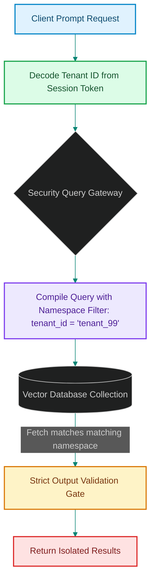

# Multi-Tenant Vector Isolation: Designing Secure Namespace Queries for Swarms

> [!NOTE]
> **📖 Article Overview**
> Multi-agent platforms deployed in enterprise environments frequently handle multi-tenant architectures. If a client query fetches document embeddings belonging to another customer organization, it triggers a catastrophic data leak violation. Unlike relational databases that use simple row-level joins, vector databases require explicit indexing partitioning to run queries safely. In this article, we analyze **Multi-Tenant Vector Isolation**, compare namespace partitioning models, and implement a secure tenant filter query constructor in Python.

---

## The Danger of Global Vector Scans

In naive RAG implementations, all tenant embeddings are stored in a single flat database collection:
* **The Filter Bypass Threat**: If an agent requests documentation context, relying on semantic distance alone can retrieve another tenant's files if the text shares semantic similarities [1].
* **The Partition Escape**: Attackers executing prompt injections can trick retrieval agents into ignoring filter criteria, resulting in a global database scan.
* **The Solution**: **Namespace Partitioning**. We enforce strict isolation either by creating separate physical collections per tenant, or by constructing pre-filtered query payloads that restrict matches to the tenant's namespace.



---

## 1. Namespace Partitioning Topologies

We choose between two primary multi-tenant architectures:
* **Logical Isolation (Metadata Filtering)**: All tenant vectors reside in the same collection, partitioned using a metadata field (e.g. `tenant_id = 'tenant_A'`). This is cost-effective but requires strict gatekeepers to prevent filter omissions.
* **Physical Isolation (Multi-Collection)**: Creating dedicated physical vector databases or collections per tenant. This offers the highest security boundary but increases infrastructure overhead.

---

## 2. Decoupling the Query Gateway

The security boundary must reside in the **API Gateway Layer**, not in the agent logic:
1. The gateway decrypts the client's session JWT and extracts the `tenant_id`.
2. It constructs the query payload, injecting the tenant filter metadata programmatically before forwarding the request to the database.

---

## Code Demo: Secure Namespace Filter Constructor

Below is a Python implementation of a query constructor. It decodes tenant variables, compiles secure query payloads, and blocks unpartitioned searches.

```python
import json
from typing import Dict, Any, Tuple

class SecureVectorQueryGateway:
    def __init__(self):
        # Database containing mock document chunks
        self.vector_db = [
            {"id": "chunk_1", "tenant_id": "tenant_A", "text": "Company A financial forecast config."},
            {"id": "chunk_2", "tenant_id": "tenant_B", "text": "Company B database passwords layout."}
        ]

    def execute_secure_query(self, session_token: str, query_vector: list) -> Tuple[bool, list]:
        # 1. Simulating JWT decoding and tenant verification
        if session_token == "token_user_a":
            tenant_id = "tenant_A"
        elif session_token == "token_user_b":
            tenant_id = "tenant_B"
        else:
            return False, ["Security Alert: Unauthorized session token."]

        # 2. Compile pre-filtered database query payload
        # This prevents the vector database from scanning outside the tenant boundary
        filtered_results = []
        
        for record in self.vector_db:
            # Enforce namespace match constraint
            if record["tenant_id"] == tenant_id:
                filtered_results.append({
                    "id": record["id"],
                    "text": record["text"],
                    "tenant_id": record["tenant_id"]
                })

        return True, filtered_results

if __name__ == "__main__":
    gateway = SecureVectorQueryGateway()

    # User A requests access to search context
    print("🔒 Simulating Secure Tenant Isolation Queries...")
    print("-------------------------------------------------")
    
    success_a, results_a = gateway.execute_secure_query("token_user_a", [0.1, 0.2])
    print(f"[User A] Execution Status: {success_a}")
    print(f"👉 Returned Documents: {results_a}")

    # User B requests access to search context
    success_b, results_b = gateway.execute_secure_query("token_user_b", [0.1, 0.2])
    print(f"\n[User B] Execution Status: {success_b}")
    print(f"👉 Returned Documents: {results_b}")
```

---

## Security Takeaways for Infrastructure Leads

* **Inject Filters at the Gateway**: Never allow frontend agents to build database queries directly. Enforce tenant filters at the backend API gateway layer.
* **Encrypt Namespace Keys**: Use secure cryptographic hashes as tenant metadata partition keys to prevent data exposure.
* **Audit collections**: Periodically run cross-tenant search audits to verify that filters are actively blocking leakage. [2]

## References & Further Reading

1. **Malkov, Y. A., & Yashunin, D. A. (2018)**. *Efficient and Robust Approximate Nearest Neighbor Search Using Hierarchical Navigable Small World Graphs*. IEEE TPAMI. [https://arxiv.org/abs/1603.09320](https://arxiv.org/abs/1603.09320)
2. **Jégou, H., Douze, M., & Schmid, C. (2011)**. *Product Quantization for Nearest Neighbor Search*. IEEE TPAMI. [https://hal.inria.fr/inria-00514462v2/document](https://hal.inria.fr/inria-00514462v2/document)
3. **Johnson, J., Douze, M., & Jégou, H. (2019)**. *Billion-scale Similarity Search with GPUs*. IEEE Transactions on Big Data. [https://arxiv.org/abs/1702.08734](https://arxiv.org/abs/1702.08734)
4. **PostgreSQL Global Development Group (2024)**. *PostgreSQL Documentation*. postgresql.org. [https://www.postgresql.org/docs/current/](https://www.postgresql.org/docs/current/)
5. **Reed, D. P. (1978)**. *Naming and Synchronization in a Decentralized Computer System*. MIT PhD Thesis. [https://www.lcs.mit.edu/publications/pubs/pdf/MIT-LCS-TR-205.pdf](https://www.lcs.mit.edu/publications/pubs/pdf/MIT-LCS-TR-205.pdf)
6. **Bayer, R., & McCreight, E. (1972)**. *Organization and Maintenance of Large Ordered Indexes*. Acta Informatica. [https://doi.org/10.1007/BF00288683](https://doi.org/10.1007/BF00288683)
