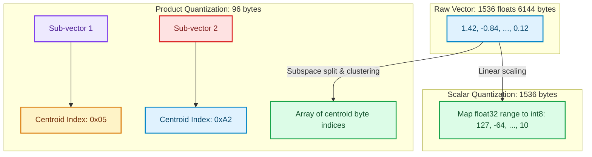

# Vector Quantization Semantics: Product vs. Scalar Quantization at Scale

When managing vector databases, **VRAM and RAM memory footprints** are the primary cost bottlenecks [1]. Storing one million 1536-dimensional vectors using standard 32-bit floating-point numbers (`float32`) requires:

$$\text{Memory} = 1,000,000 \times 1536 \times 4 \text{ bytes} \approx 6.14 \text{ GB}$$

Once you build an HNSW index, this memory usage doubles to over **12 GB**. Storing hundreds of millions of vectors in production requires hundreds of gigabytes of expensive memory, making raw vector storage economically unsustainable.

To solve this, modern vector engines utilize **Vector Quantization** to compress floating-point values into compact byte representations. This article covers the mechanics of **Scalar Quantization (SQ)** and **Product Quantization (PQ)** and how to implement them in production.

---

## Quantization Mechanics: SQ vs. PQ



### 1. Scalar Quantization (SQ)
Scalar Quantization compresses each dimension of a vector independently by mapping floating-point values from a continuous range (e.g., $[-1.0, 1.0]$) to a discrete set of integers (typically 8-bit integers, $int8$, representing $[-128, 127]$).
* **Compression Ratio**: Exact **4x reduction** (from 4 bytes to 1 byte per dimension).
* **Accuracy Loss**: Minimal. High-quality SQ implementations (like SQ8) retain **>98% of search recall accuracy** compared to raw float searches.

### 2. Product Quantization (PQ)
Product Quantization is a lossy compression technique that clusters multidimensional vector spaces:
1. **Subspace Division**: A high-dimensional vector (e.g., $D=1024$) is split into $m$ smaller sub-vectors (e.g., $m=128$ sub-vectors of dimension $d=8$).
2. **Centroid Clustering**: For each of the $m$ subspaces, K-Means clustering is executed across the dataset to find a set of centroids (typically $K=256$, which fits in a single 8-bit byte).
3. **Index Assignment**: The sub-vectors are replaced with the 1-byte index of their nearest centroid.
* **Compression Ratio**: Up to **16x to 64x reduction** (e.g. 1024 float32 dimensions compressed into 128 bytes).
* **Accuracy Loss**: Moderate. PQ can cause recall drops of 5–15%, making it ideal for coarse-grained routing before running exact re-ranking.

---

## Configuring Quantization in Qdrant Collections

Qdrant supports native Scalar and Product Quantization configurations on collection startup.

### 1. Configuring Scalar Quantization (SQ)
Here is a collection configuration optimized for 4x compression using 8-bit Scalar Quantization, enabling fast HNSW graph traversal:

```json
{
  "name": "sq_collection",
  "vectors": {
    "size": 1536,
    "distance": "Cosine"
  },
  "quantization_config": {
    "scalar": {
      "type": "int8",
      "available_on_ram": true,
      "always_ram": true
    }
  }
}
```

### 2. Configuring Product Quantization (PQ)
Here is a configuration for high-ratio Product Quantization, dividing 1536 dimensions into 96 sub-vectors (compression ratio of 16x):

```json
{
  "name": "pq_collection",
  "vectors": {
    "size": 1536,
    "distance": "Cosine"
  },
  "quantization_config": {
    "product": {
      "compression": "x16",
      "always_ram": false
    }
  }
}
```

---

## Memory and Latency Footprints

| Index Type | VRAM per 1M Vectors | Query Latency | Search Recall Accuracy |
| :--- | :---: | :---: | :---: |
| **Raw float32** | 6.14 GB | Baseline (1.0x) | **100.0% (Exact)** |
| **Scalar (SQ8)** | 1.54 GB | 0.8x (Faster cache reads) | **~98.5%** |
| **Product (PQx16)** | 384 MB | 1.5x (Unpacking overhead) | **~88.0%** |

---

## Important Pitfalls in Quantization

Ensure your configuration balances compression and precision:

> [!IMPORTANT]
> **Use Over-Sampling to Recover Precision**: When querying highly compressed PQ indexes, you can recover lost recall by requesting more candidates during the HNSW search phase (e.g. increase `hnsw_ef` to 128) and re-scoring only the top results using original vectors.

> [!CAUTION]
> **Cold Startup Delays**: Setting `always_ram: false` in Qdrant configures the engine to read quantized files from disk. While this saves RAM, it can create massive latency spikes on cold boots. Keep critical index files locked in memory if sub-10ms response times are required. [2]

## References & Further Reading

1. **Malkov, Y. A., & Yashunin, D. A. (2018)**. *Efficient and Robust Approximate Nearest Neighbor Search Using Hierarchical Navigable Small World Graphs*. IEEE TPAMI. [https://arxiv.org/abs/1603.09320](https://arxiv.org/abs/1603.09320)
2. **Jégou, H., Douze, M., & Schmid, C. (2011)**. *Product Quantization for Nearest Neighbor Search*. IEEE TPAMI. [https://hal.inria.fr/inria-00514462v2/document](https://hal.inria.fr/inria-00514462v2/document)
3. **Johnson, J., Douze, M., & Jégou, H. (2019)**. *Billion-scale Similarity Search with GPUs*. IEEE Transactions on Big Data. [https://arxiv.org/abs/1702.08734](https://arxiv.org/abs/1702.08734)
4. **Lin, J., et al. (2024)**. *AWQ: Activation-aware Weight Quantization for LLM Compression and Acceleration*. MLSys. [https://arxiv.org/abs/2306.00978](https://arxiv.org/abs/2306.00978)
5. **Frantar, E., et al. (2023)**. *GPTQ: Accurate Post-Training Quantization for Generative Pre-trained Transformers*. ICLR. [https://arxiv.org/abs/2210.17323](https://arxiv.org/abs/2210.17323)
6. **Wang, H., et al. (2023)**. *BitNet: Scaling 1-bit Transformers for Large Language Models*. arXiv. [https://arxiv.org/abs/2310.11453](https://arxiv.org/abs/2310.11453)
