# What Nobody Tells You About Vector Embeddings in Production

> [!NOTE]
> **📖 Article Overview**
> Vector embeddings are the foundation of every RAG system, semantic search engine, and recommendation pipeline. Yet most tutorials stop at `model.encode(text)` and call it done. In production, embeddings fail in ways that are silent, subtle, and catastrophically expensive to debug: wrong distance metrics returning garbage silently, stale embeddings after model upgrades corrupting search results, dimension mismatches crashing pipelines at 2am, and tokenisation limits silently truncating your most important documents. This article covers **8 production embedding failures** with exact fixes in **Python**, covering pgvector, Pinecone, Weaviate, and the Sentence Transformers / OpenAI embedding APIs.

---

## Why Embedding Bugs Are the Hardest to Find

A broken SQL query throws an exception. A broken embedding pipeline returns results — just wrong ones. Cosine similarity between a garbage vector and a real one is still a number. Your API returns 200 OK. Your users get irrelevant answers. Your eval metrics don't catch it because the eval dataset was embedded with the same broken model.

This is the danger zone: **silent correctness failures** with no stack traces.

---

## The Embedding Production Failure Map

```mermaid
%%{init: {'theme': 'dark', 'themeVariables': { 'primaryColor': '#a855f7', 'primaryTextColor': '#f3f4f6', 'primaryBorderColor': '#c084fc', 'lineColor': '#a855f7', 'secondaryColor': '#111827', 'tertiaryColor': '#0f172a'}}}%%
flowchart TD
    D[Document] --> T[Tokeniser]
    T -->|Truncated silently| F1[💥 Trap 1: Silent truncation<br/>at 512 tokens]
    T -->|OK| E[Embedding Model]
    
    E -->|Model version changed| F2[💥 Trap 2: Stale index<br/>after model upgrade]
    E -->|OK| V[(Vector Store)]
    
    V -->|Wrong metric configured| F3[💥 Trap 3: Cosine vs<br/>dot product mismatch]
    V -->|No normalisation| F4[💥 Trap 4: L2 distance<br/>on unnormalised vectors]
    V -->|OK| Q[Query Embedding]
    
    Q -->|Different model than index| F5[💥 Trap 5: Query/index<br/>model mismatch]
    Q -->|OK| R[Search Results]
    
    R -->|No re-embedding on update| F6[💥 Trap 6: Stale doc<br/>embeddings after edit]
    R -->|Multilingual mismatch| F7[💥 Trap 7: Cross-lingual<br/>query on mono model]
    R -->|Batch dim mismatch| F8[💥 Trap 8: Dimension<br/>mismatch on insert]

    style F1 fill:#7f1d1d,stroke:#ef4444,stroke-width:2px
    style F2 fill:#7f1d1d,stroke:#ef4444,stroke-width:2px
    style F3 fill:#78350f,stroke:#f59e0b,stroke-width:2px
    style F4 fill:#78350f,stroke:#f59e0b,stroke-width:2px
    style F5 fill:#7f1d1d,stroke:#ef4444,stroke-width:2px
    style F6 fill:#1e3a5f,stroke:#3b82f6,stroke-width:2px
    style F7 fill:#1e3a5f,stroke:#3b82f6,stroke-width:2px
    style F8 fill:#78350f,stroke:#f59e0b,stroke-width:2px
```



---

## Trap 1: Silent Truncation at 512 Tokens

**Symptom**: Long documents return poor search results despite being highly relevant. No errors thrown.

**Root cause**: Most embedding models (BERT-based, `text-embedding-ada-002`, `all-MiniLM`) have a **hard 512-token limit**. Anything beyond that is silently dropped. A 2,000-word policy document gets embedded using only the first ~375 words. The rest — often where the critical detail lives — is invisible to search.

```python
from sentence_transformers import SentenceTransformer
from transformers import AutoTokenizer
import numpy as np

model_name = "sentence-transformers/all-MiniLM-L6-v2"
model = SentenceTransformer(model_name)
tokenizer = AutoTokenizer.from_pretrained(model_name)

def safe_embed_with_chunking(
    text: str,
    max_tokens: int = 512,
    overlap_tokens: int = 50,
    pooling: str = "mean"  # "mean" | "first" | "last"
) -> np.ndarray:
    """
    Embeds long text by splitting into overlapping chunks and pooling.
    Prevents silent truncation of content beyond the model's token limit.
    """
    tokens = tokenizer.encode(text, add_special_tokens=False)
    
    if len(tokens) <= max_tokens:
        return model.encode(text, normalize_embeddings=True)
    
    # Split into overlapping chunks
    stride = max_tokens - overlap_tokens
    chunks = []
    for start in range(0, len(tokens), stride):
        chunk_tokens = tokens[start:start + max_tokens]
        chunk_text = tokenizer.decode(chunk_tokens, skip_special_tokens=True)
        chunks.append(chunk_text)
        if start + max_tokens >= len(tokens):
            break
    
    # Embed all chunks
    chunk_embeddings = model.encode(chunks, normalize_embeddings=True, batch_size=32)
    
    # Pool chunk embeddings
    if pooling == "mean":
        return np.mean(chunk_embeddings, axis=0)
    elif pooling == "first":
        return chunk_embeddings[0]
    elif pooling == "last":
        return chunk_embeddings[-1]
    
    return np.mean(chunk_embeddings, axis=0)

def check_truncation_risk(texts: list[str], model_name: str, threshold: float = 0.9) -> list[dict]:
    """Audit a batch of texts and flag those near the token limit."""
    tokenizer = AutoTokenizer.from_pretrained(model_name)
    max_tokens = tokenizer.model_max_length
    
    risks = []
    for text in texts:
        token_count = len(tokenizer.encode(text))
        ratio = token_count / max_tokens
        if ratio > threshold:
            risks.append({
                "text_preview": text[:100],
                "token_count": token_count,
                "limit": max_tokens,
                "truncated_pct": round((1 - max_tokens / token_count) * 100, 1) if token_count > max_tokens else 0,
                "status": "TRUNCATED" if token_count > max_tokens else "AT_RISK"
            })
    return risks
```

---

## Trap 2: Stale Index After Model Upgrade

**Symptom**: You upgrade from `text-embedding-ada-002` to `text-embedding-3-large`. Existing documents in your index were embedded with the old model. Queries use the new model. Search quality collapses — you're comparing apples to oranges in high-dimensional space.

**Root cause**: Different embedding models produce vectors in **completely different semantic spaces**. You cannot mix vectors from different models in the same index.

```python
import hashlib
import json
from datetime import datetime
from typing import Optional

# ─── Embedding Model Registry ─────────────────────────
EMBEDDING_MODEL_REGISTRY = {
    "current": {
        "name": "text-embedding-3-large",
        "provider": "openai",
        "dimensions": 3072,
        "version": "2024-01-25",
        "fingerprint": "openai-te3-large-20240125"
    },
    "deprecated": [
        {"fingerprint": "openai-ada-002-20221201", "name": "text-embedding-ada-002"}
    ]
}

def get_model_fingerprint(model_name: str, model_version: str) -> str:
    """Deterministic fingerprint for a model version."""
    return hashlib.sha256(f"{model_name}:{model_version}".encode()).hexdigest()[:16]

class EmbeddingVersionGuard:
    """
    Attaches model fingerprints to every embedded document.
    Raises an error if a query model doesn't match the index model.
    """

    def embed_document(
        self,
        doc_id: str,
        text: str,
        client,
        model: str = "text-embedding-3-large"
    ) -> dict:
        """Embed with model metadata attached."""
        response = client.embeddings.create(input=text, model=model)
        
        return {
            "doc_id": doc_id,
            "vector": response.data[0].embedding,
            "metadata": {
                "embedding_model": model,
                "embedding_model_fingerprint": get_model_fingerprint(model, "v1"),
                "embedded_at": datetime.utcnow().isoformat(),
                "token_count": response.usage.total_tokens,
            }
        }
    
    def validate_query_model(
        self,
        query_model: str,
        index_model_fingerprint: str
    ) -> None:
        """Assert query and index use compatible models before searching."""
        query_fingerprint = get_model_fingerprint(query_model, "v1")
        if query_fingerprint != index_model_fingerprint:
            raise ValueError(
                f"Model mismatch! Index was built with fingerprint '{index_model_fingerprint}' "
                f"but query uses '{query_model}' (fingerprint: '{query_fingerprint}'). "
                f"Re-index all documents before querying with the new model."
            )

# Migration helper: detect stale documents in bulk
def audit_index_for_stale_embeddings(
    documents: list[dict],
    current_model_fingerprint: str
) -> dict:
    stale = [d for d in documents if d.get("metadata", {}).get("embedding_model_fingerprint") != current_model_fingerprint]
    return {
        "total": len(documents),
        "stale_count": len(stale),
        "stale_ids": [d["doc_id"] for d in stale[:20]],  # First 20 for preview
        "action_required": len(stale) > 0,
        "recommendation": f"Re-embed {len(stale)} documents with current model before enabling search."
    }
```

---

## Trap 3: Cosine vs Dot Product — Silent Wrong Results

**Symptom**: Semantically identical sentences score poorly. Unrelated sentences score high. No errors, no warnings.

**Root cause**: OpenAI `text-embedding-3-*` models return **normalised vectors** — for these, cosine similarity and dot product are equivalent. But `text-embedding-ada-002` and many HuggingFace models return **unnormalised vectors** — using dot product on these gives entirely wrong rankings based on vector magnitude, not semantic similarity.

```python
import numpy as np
from openai import OpenAI

client = OpenAI()

def embed(text: str, model: str = "text-embedding-ada-002") -> np.ndarray:
    response = client.embeddings.create(input=text, model=model)
    return np.array(response.data[0].embedding)

def cosine_similarity(a: np.ndarray, b: np.ndarray) -> float:
    return float(np.dot(a, b) / (np.linalg.norm(a) * np.linalg.norm(b)))

def dot_product(a: np.ndarray, b: np.ndarray) -> float:
    return float(np.dot(a, b))

def is_normalised(vec: np.ndarray, tolerance: float = 1e-3) -> bool:
    """Check if a vector has unit norm (i.e., is already normalised)."""
    norm = np.linalg.norm(vec)
    return abs(norm - 1.0) < tolerance

def safe_similarity(a: np.ndarray, b: np.ndarray) -> float:
    """
    Always uses cosine similarity — normalises first if needed.
    Safe for both normalised and unnormalised vectors.
    """
    if not is_normalised(a):
        a = a / np.linalg.norm(a)
    if not is_normalised(b):
        b = b / np.linalg.norm(b)
    return float(np.dot(a, b))  # Equivalent to cosine after normalisation

# Demonstrate the danger
if __name__ == "__main__":
    v1 = embed("How do I implement rate limiting?")
    v2 = embed("What are the best rate limiter algorithms?")  # Semantically similar
    v3 = embed("What is the capital of France?")  # Semantically different
    
    print("=== Cosine Similarity (Correct) ===")
    print(f"Similar pair:   {cosine_similarity(v1, v2):.4f}")  # Should be HIGH
    print(f"Different pair: {cosine_similarity(v1, v3):.4f}")  # Should be LOW

    print("\n=== Dot Product on Unnormalised Vectors (Can Be Wrong) ===")
    print(f"Similar pair:   {dot_product(v1, v2):.4f}")
    print(f"Different pair: {dot_product(v1, v3):.4f}")  # May rank incorrectly!
    
    print("\n=== Is this model normalised? ===")
    print(f"v1 normalised: {is_normalised(v1)}")  # ada-002: False, te3-large: True
```

**pgvector index tip — use the right operator class:**

```sql
-- For normalised vectors (OpenAI te3-*): use <=> (cosine) or <#> (negative dot product)
CREATE INDEX ON documents USING hnsw (embedding vector_cosine_ops);

-- For unnormalised vectors: ALWAYS use cosine, never inner product
-- Or normalise on insert:
UPDATE documents SET embedding = embedding / |embedding|;  -- normalise existing vectors
```

---

## Trap 4: Dimension Mismatch Corrupts Silently in Some Stores

**Symptom**: You switch embedding models (e.g., 1536-dim ada-002 to 3072-dim te3-large). Some vector databases silently truncate or pad vectors to match the index dimension. Others throw cryptic internal errors. Your data is corrupt.

```python
from dataclasses import dataclass

@dataclass
class EmbeddingDimensionGuard:
    expected_dim: int
    model_name: str

    def validate(self, vector: list[float], doc_id: str) -> list[float]:
        actual_dim = len(vector)
        if actual_dim != self.expected_dim:
            raise ValueError(
                f"Dimension mismatch for doc '{doc_id}': "
                f"expected {self.expected_dim}D (model: {self.model_name}), "
                f"got {actual_dim}D. "
                f"Did you change the embedding model without re-creating the index?"
            )
        return vector

# Usage
guard = EmbeddingDimensionGuard(expected_dim=3072, model_name="text-embedding-3-large")

def safe_upsert(doc_id: str, text: str, client, pg_conn):
    response = client.embeddings.create(input=text, model="text-embedding-3-large")
    vector = guard.validate(response.data[0].embedding, doc_id)  # Raises before bad insert
    pg_conn.execute(
        "INSERT INTO documents (id, embedding) VALUES (%s, %s) ON CONFLICT (id) DO UPDATE SET embedding = EXCLUDED.embedding",
        (doc_id, vector)
    )
```

---

## Trap 5: Multilingual Queries on Monolingual Models

**Symptom**: Your English-trained RAG system is deployed to users in Pakistan, Germany, and Japan. Non-English queries return near-random results.

**Root cause**: English-only embedding models (many MiniLM variants) project non-English text into a meaningless region of the embedding space. The cosine similarities are numerically valid but semantically meaningless.

```python
# Use multilingual models for international deployments
MULTILINGUAL_MODELS = {
    "high_quality": "intfloat/multilingual-e5-large",      # 560M params, 100 languages
    "fast": "sentence-transformers/paraphrase-multilingual-MiniLM-L12-v2",  # 118M, 50 languages
    "openai": "text-embedding-3-large",                     # OpenAI supports 100+ languages natively
}

def detect_language_and_route(text: str) -> str:
    """Route to appropriate embedding model based on detected language."""
    try:
        from langdetect import detect
        lang = detect(text)
        if lang == 'en':
            return "text-embedding-3-small"   # Cheaper for English-only
        else:
            return "text-embedding-3-large"   # Better multilingual performance
    except Exception:
        return "text-embedding-3-large"       # Safe default on detection failure
```

---

## Trap 6: Documents Updated But Embeddings Not Refreshed

**Symptom**: A user edits a document. The document text in your database is updated. But the embedding in your vector store still reflects the old content. Search returns the old version's content.

```python
import hashlib

def get_content_hash(text: str) -> str:
    return hashlib.sha256(text.encode('utf-8')).hexdigest()

class EmbeddingFreshnessChecker:
    """Detects when document content has changed and embeddings need refreshing."""
    
    def should_re_embed(self, doc_id: str, current_text: str, stored_hash: str | None) -> bool:
        current_hash = get_content_hash(current_text)
        if stored_hash is None or stored_hash != current_hash:
            print(f"[Embeddings] Doc '{doc_id}' content changed — queuing re-embed")
            return True
        return False

    async def sync_document(self, doc_id: str, text: str, stored_hash: str | None, embed_fn, store_fn):
        if self.should_re_embed(doc_id, text, stored_hash):
            new_vector = await embed_fn(text)
            new_hash = get_content_hash(text)
            await store_fn(doc_id, new_vector, new_hash)
            return True
        return False  # No update needed
```

---

## Conclusion & Key Takeaways

Vector embeddings are deceptively fragile at the boundaries — tokenisation limits, model versioning, distance metric mismatches, and content staleness all fail silently, making them uniquely difficult to debug in production.

*   **Always store a model fingerprint alongside every vector** — it's the only way to detect index staleness after a model upgrade.
*   **Always use cosine similarity** unless you have explicitly confirmed your model outputs normalised vectors and have benchmarked dot product against it.
*   **Audit token counts before embedding**, not after — truncation at 512 tokens discards data with no exception raised.

---

### Research References & Resources
*   **OpenAI Embeddings Guide**: [Best practices for using embeddings](https://platform.openai.com/docs/guides/embeddings)
*   **Sentence Transformers**: [Pretrained Models Reference](https://www.sbert.net/docs/pretrained_models.html)
*   **pgvector Distance Operators**: [pgvector README](https://github.com/pgvector/pgvector#distance-functions)
