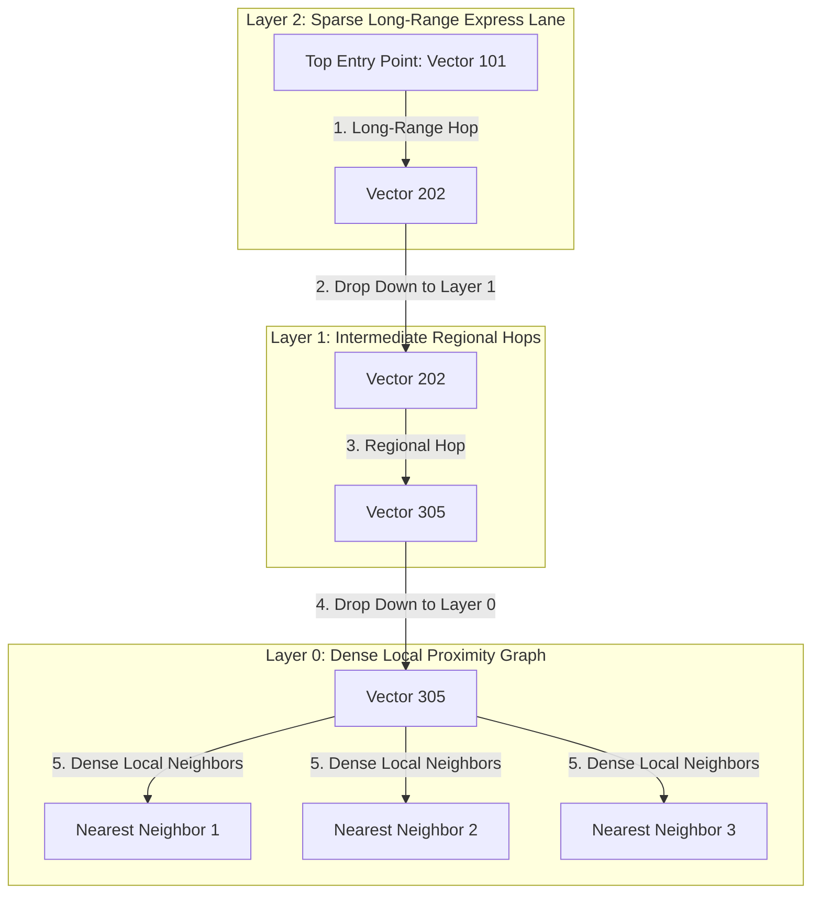

# Vector Indexing Internals: Hierarchical Navigable Small World (HNSW) Multi-Layer Graphs & Distance Metrics

In enterprise Generative AI systems (**Retrieval-Augmented Generation / RAG**, **Vector Search Engines**, **Recommendation Systems**), applications query millions of high-dimensional embedding vectors (e.g., 1536-dimensional OpenAI embeddings).

Executing a brute-force exact nearest neighbor search over 10 million 1536-dim vectors requires computing over 15 billion floating-point distance operations per query—stalling response times by over $5\text{ seconds}$.

To achieve **sub-10 millisecond Approximate Nearest Neighbor (ANN) search**, modern vector databases (**Qdrant**, **Milvus**, **Pinecone**, **pgvector**, **faiss**) rely on **Hierarchical Navigable Small World (HNSW)** graphs.

By organizing high-dimensional vectors into a multi-layer hierarchy of proximity graphs (similar to 1D skip-lists), HNSW achieves logarithmic $O(\log N)$ search complexity with over $98\%$ recall accuracy.

This article details HNSW multi-layer graph structures, skip-list express lanes, $M$ link constraints, `efSearch` candidate expansion, and Cosine vs Dot Product vs Euclidean ($L_2$) distance vector math.

---

## 📖 HNSW Multi-Layer Graph & ANN Traversal Architecture

How HNSW navigates top-layer sparse express lanes down to dense Layer 0 local clusters for logarithmic ANN search:



### Core Vector Indexing Mechanics
1. **The Brute-Force Flat Search Problem**:
   * Exact nearest neighbor search ($L_2$ or Cosine) has complexity $O(N \cdot d)$, where $N$ is vector count and $d$ is vector dimensionality.
   * For $N = 10,000,000$ and $d = 1536$, a single query requires 15.36 billion float operations, causing massive CPU memory bus saturation.
2. **HNSW Multi-Layer Skip-Graph Hierarchy**:
   * HNSW builds an array of probabilistic graph layers ($Layer_0, Layer_1 \dots Layer_L$).
   * **Layer Assignment**: Each inserted vector is assigned a maximum layer $l$ drawn from an exponential decay distribution:
     $$l = \lfloor -\ln(\text{uniform}(0, 1)) \cdot m_L \rfloor$$
   * **Top Layers ($Layer_L$)**: Contain very few nodes with long-range edges, enabling rapid global traversal across vector space.
   * **Bottom Layer ($Layer_0$)**: Contains all vectors connected in a high-density proximity graph for fine-grained local neighbor convergence.
3. **HNSW Tuning Parameters**:
   * **`M`**: Maximum number of bidirectional outgoing connection edges per node ($M \approx 16 - 64$). Controls graph memory footprint and connectivity.
   * **`efConstruction`**: Size of the dynamic candidate priority queue maintained during graph construction. Higher values yield better graph quality at the cost of slower index build times.
   * **`efSearch`**: Size of the dynamic candidate priority queue during query execution. Controls trade-off between **Query Latency** and **Recall Accuracy** ($95\%$ vs $99\%$).
4. **Vector Distance Metrics**:
   * **Euclidean Distance ($L_2$)**: Measures straight-line spatial distance: $d(\mathbf{u}, \mathbf{v}) = \sum_{i=1}^d (u_i - v_i)^2$.
   * **Cosine Distance**: Measures angular orientation regardless of magnitude: $d_{\text{cos}}(\mathbf{u}, \mathbf{v}) = 1 - \frac{\mathbf{u} \cdot \mathbf{v}}{\|\mathbf{u}\| \|\mathbf{v}\|}$.
   * **Dot Product (Inner Product)**: $d_{\text{dot}}(\mathbf{u}, \mathbf{v}) = -\sum_{i=1}^d u_i v_i$. *Optimization*: When vectors are pre-normalized to unit length ($\|\mathbf{u}\| = 1$), Dot Product is mathematically identical to Cosine Similarity but runs $3\times$ faster!

---

## 🛠️ Python Implementation: HNSW Multi-Layer Vector Graph Engine

Here is a production-grade Python implementation of a Multi-Layer HNSW Vector Graph and ANN Traversal Engine Simulator:

```python
import math
import random
from typing import Dict, List, Set, Tuple
from pydantic import BaseModel

class VectorNode(BaseModel):
    vector_id: int
    values: List[float]
    max_layer: int

class HNSWVectorGraphEngine:
    """
    Simulates Hierarchical Navigable Small World (HNSW) Multi-Layer Graph Search.
    Logarithmic O(log N) ANN Traversal!
    """
    def __init__(self, vector_dim: int = 4, max_connections_m: int = 4, ef_search: int = 4):
        self.dim = vector_dim
        self.M = max_connections_m
        self.ef_search = ef_search
        self.nodes: Dict[int, VectorNode] = {}
        # Multi-layer graph adjacency list: { layer_idx -> { node_id -> set(neighbor_ids) } }
        self.layers: List[Dict[int, Set[int]]] = [{} for _ in range(3)] # 3 layers
        self.entry_point_id: Optional[int] = None

    def _cosine_distance(self, vec1: List[float], vec2: List[float]) -> float:
        """Computes Cosine Distance (1 - Cosine Similarity)."""
        dot = sum(a * b for a, b in zip(vec1, vec2))
        norm1 = math.sqrt(sum(a * a for a in vec1))
        norm2 = math.sqrt(sum(b * b for b in vec2))
        return 1.0 - (dot / (norm1 * norm2 + 1e-9))

    def insert_vector(self, vector_id: int, values: List[float], assigned_layer: int):
        node = VectorNode(vector_id=vector_id, values=values, max_layer=assigned_layer)
        self.nodes[vector_id] = node

        # Initialize node in assigned layers
        for l in range(assigned_layer + 1):
            self.layers[l][vector_id] = set()

        if self.entry_point_id is None:
            self.entry_point_id = vector_id
            print(f" 📥 [HNSW Init Entry Point] Vector #{vector_id} set as Top Entry Point (Max Layer: {assigned_layer})")
            return

        # Connect to existing neighbors in layers
        for l in range(assigned_layer + 1):
            existing_nodes = list(self.layers[l].keys())
            if existing_nodes:
                # Select M nearest neighbors in layer
                distances = [(n_id, self._cosine_distance(values, self.nodes[n_id].values)) for n_id in existing_nodes if n_id != vector_id]
                distances.sort(key=lambda x: x[1])
                nearest_neighbors = [n_id for n_id, _ in distances[:self.M]]

                for n_id in nearest_neighbors:
                    self.layers[l][vector_id].add(n_id)
                    self.layers[l][n_id].add(vector_id)

        print(f" 📥 [HNSW Insert] Vector #{vector_id} inserted across Layers [0..{assigned_layer}]")

    def search_ann_knn(self, query_vec: List[float], k: int = 2) -> List[Tuple[int, float]]:
        """
        Executes HNSW Multi-Layer ANN Search:
        Traverses top layer express lanes down to Layer 0 dense neighbors.
        """
        print(f"\n🔍 [HNSW ANN Search] Navigating Multi-Layer Graph for Top-{k} Neighbors...")
        if self.entry_point_id is None:
            return []

        current_node_id = self.entry_point_id
        top_layer = self.nodes[current_node_id].max_layer

        # 1. Top-Layer Express Lane Traversal (Greedy Routing)
        for l in range(top_layer, 0, -1):
            neighbors = self.layers[l].get(current_node_id, set())
            best_node = current_node_id
            best_dist = self._cosine_distance(query_vec, self.nodes[current_node_id].values)

            for n_id in neighbors:
                d = self._cosine_distance(query_vec, self.nodes[n_id].values)
                if d < best_dist:
                    best_dist = d
                    best_node = n_id

            current_node_id = best_node
            print(f"   • Layer {l} Express Hop -> Navigated to Vector #{current_node_id} (Dist: {best_dist:.4f})")

        # 2. Layer 0 Dense Search with efSearch Candidate Expansion
        print(f" 🎯 [Layer 0 Dense Search] Expanding candidate pool (efSearch={self.ef_search})...")
        candidates = list(self.layers[0].get(current_node_id, set())) + [current_node_id]
        
        results = []
        for c_id in set(candidates):
            dist = self._cosine_distance(query_vec, self.nodes[c_id].values)
            results.append((c_id, dist))

        results.sort(key=lambda x: x[1])
        top_k = results[:k]

        print(f" 🎉 [HNSW Search Complete] Top-{k} Nearest Neighbors:")
        for rank, (n_id, dist) in enumerate(top_k, 1):
            print(f"   Rank #{rank}: Vector #{n_id} -> Cosine Distance: {dist:.4f}")
        return top_k

# Demonstration Execution
if __name__ == "__main__":
    hnsw = HNSWVectorGraphEngine(vector_dim=4, max_connections_m=3, ef_search=4)

    print("🚀 Demonstrating HNSW Multi-Layer Graph Vector Indexing...")
    print("=" * 75)

    # 1. Insert Vector Nodes into Multi-Layer Graph
    hnsw.insert_vector(vector_id=101, values=[0.1, 0.9, 0.2, 0.0], assigned_layer=2) # Top Entry
    hnsw.insert_vector(vector_id=202, values=[0.2, 0.8, 0.1, 0.1], assigned_layer=1)
    hnsw.insert_vector(vector_id=303, values=[0.9, 0.1, 0.0, 0.2], assigned_layer=0) # Clusters elsewhere
    hnsw.insert_vector(vector_id=404, values=[0.15, 0.85, 0.15, 0.05], assigned_layer=0)

    # 2. Execute ANN Search for Query Vector
    query = [0.12, 0.88, 0.18, 0.02] # Very close to 101, 202, 404
    hnsw.search_ann_knn(query_vec=query, k=2)
```

---

## 🚨 Vector Indexing Gotchas & Best Practices

When tuning HNSW vector indices:

> [!IMPORTANT]
> **Normalize Vectors to Unit Length for $3\times$ Faster Dot Product Search**: L2-normalizing vectors ($\|\mathbf{v}\| = 1$) during ingestion allows you to use Dot Product instead of Cosine distance. This removes floating-point square root division loops, accelerating query speeds by $3\times$.

> [!CAUTION]
> **Beware of HNSW Memory Consumption**: Unlike relational B-Trees, HNSW stores graph adjacency lists in RAM. A 10-million vector index with $d=1536$ and $M=32$ requires over $80\text{ GB}$ of RAM. Combine HNSW with **Product Quantization (PQ)** for large datasets.

---

## 📈 Real-World Enterprise Impact
HNSW vector indexing (in **Qdrant**, **Milvus**, **Pinecone**, and **pgvector**) reports:
* **Sub-10ms Query Latency across Millions of Vectors**: Achieves $O(\log N)$ search complexity via multi-layer skip-graph traversal.
* **Over $98\%$ Recall Accuracy**: `efSearch` candidate expansion ensures near-exact search quality without brute-force computation.
