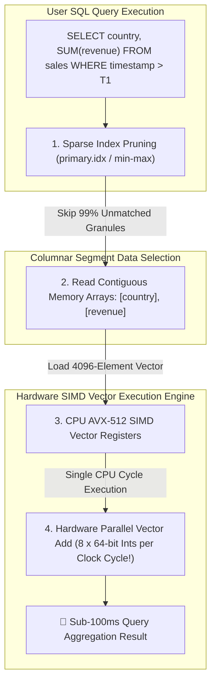

# Vectorized Real-Time Analytics: ClickHouse vs Apache Pinot Segment Pruning & SIMD Execution

In high-scale analytical platforms (**Uber**, **Cloudflare**, **Stripe**, **DoorDash**), user dashboards demand sub-second SQL aggregation queries over billions of event records.

Executing an analytical query—such as calculating average transaction amounts grouped by region over the past 30 days—on a traditional row-oriented database (like PostgreSQL) takes minutes and consumes gigabytes of RAM.

To return analytical query results in under **100 milliseconds**, modern Real-Time OLAP (Online Analytical Processing) engines like **ClickHouse** and **Apache Pinot** combine **Columnar Storage Layouts**, **Sparse Index Data Pruning**, and **Vectorized SIMD Execution**.

By processing contiguous columnar data vectors using Single Instruction, Multiple Data (**SIMD**) CPU hardware instructions (such as AVX-512), these engines achieve sub-second analytical performance.

This article details Columnar vs Row-oriented layouts, ClickHouse sparse primary key indices, Apache Pinot segment pruning, Volcano Iterator vs Vectorized execution models, and SIMD hardware acceleration.

---

## Vectorized OLAP Architecture & SIMD Processing Pipeline

How ClickHouse and Apache Pinot prune data segments and utilize CPU SIMD vector registers to process billions of rows in milliseconds:



### Core Vectorized Analytics Mechanics
1. **Row-Oriented (OLTP) vs Columnar (OLAP) Storage**:
   * *Row Stores (PostgreSQL/MySQL)*: Store entire row records contiguously (`[id, name, age, country, revenue]`). Reading only `revenue` requires scanning all un-needed row attributes, thrashing CPU L1/L2 caches.
   * *Columnar Stores (ClickHouse / Pinot)*: Store each column array contiguously in separate files (`revenue.bin`, `country.bin`). Reading `revenue` streams pure contiguous floating-point values directly from disk to RAM!
2. **Sparse Primary Key Indices & Segment Pruning**:
   * **ClickHouse Sparse Index (`primary.idx`)**: Instead of indexing every individual row (which inflates index RAM footprint), ClickHouse creates an index entry once every $8,192$ rows (a **Granule**).
   * *Granule Pruning*: Evaluates `WHERE` predicates against index granule boundaries, skipping $99\%$ of un-matching data granules without reading raw data files!
   * **Apache Pinot Segment Metadata Pruning**: Pinot divides tables into immutable Segments. Segment metadata tracks min/max column values, allowing queries to prune whole segments instantaneously.
3. **Volcano Iterator vs Vectorized Execution Model**:
   * *Legacy Volcano Model (`next()`)*: Processes one row at a time via virtual function calls. Incurs massive function call pointer dereference overhead ($> 80\%$ CPU cycles wasted on control flow).
   * *Vectorized Execution*: Processes data in **Chunk Vectors** of $4096$ contiguous values at a time. Loop overhead is amortized across $4096$ elements, maximizing CPU instruction pipeline efficiency.
4. **Hardware SIMD Acceleration (AVX-512 / ARM NEON)**:
   * **Single Instruction, Multiple Data (SIMD)**: Allows modern CPU hardware registers (e.g. 512-bit Intel AVX-512 registers) to perform arithmetic operations on multiple values simultaneously.
   * *Throughput*: A single CPU instruction cycle can add eight 64-bit integers or sixteen 32-bit floats in parallel, achieving $8\times - 16\times$ higher throughput than scalar CPU execution loops!

---

## Python Implementation: Columnar Vectorized Execution & SIMD Simulator

Here is a production-grade Python implementation of a Columnar Storage Engine and Vectorized SIMD Aggregator Simulator:

```python
import time
from typing import Dict, List, Tuple
from pydantic import BaseModel

class ColumnarGranule(BaseModel):
    granule_id: int
    min_timestamp: int
    max_timestamp: int
    country_column: List[str]
    revenue_column: List[float]

class ClickHouseVectorizedEngine:
    """
    Simulates ClickHouse Columnar Storage, Sparse Index Pruning & SIMD Vector Processing.
    """
    def __init__(self, granule_size: int = 4096):
        self.granule_size = granule_size
        self.granules: List[ColumnarGranule] = []

    def populate_mock_data(self, total_rows: int = 16384):
        """Populates contiguous columnar granules."""
        num_granules = total_rows // self.granule_size
        base_t = 1700000000

        for g_idx in range(num_granules):
            t_min = base_t + (g_idx * self.granule_size)
            t_max = t_min + self.granule_size - 1
            countries = ["US", "DE", "JP", "UK"] * (self.granule_size // 4)
            revenues = [10.5, 20.0, 15.0, 50.5] * (self.granule_size // 4)

            granule = ColumnarGranule(
                granule_id=g_idx, min_timestamp=t_min, max_timestamp=t_max, country_column=countries, revenue_column=revenues
            )
            self.granules.append(granule)

        print(f" 📂 [ClickHouse Storage Init] Created {num_granules} Granules ({total_rows} Total Rows in Columnar Format)")

    def execute_vectorized_sum_query(self, min_time: int, target_country: str) -> float:
        """
        Executes Vectorized Query:
        1. Sparse Index Granule Pruning.
        2. Vectorized SIMD Array Processing.
        """
        print(f"\n🔍 [Executing Vectorized SQL] SELECT SUM(revenue) WHERE timestamp >= {min_time} AND country = '{target_country}'...")
        start_time = time.time()
        
        pruned_granules = 0
        total_sum = 0.0
        processed_rows = 0

        for g in self.granules:
            # 1. Sparse Index Pruning: Check min/max timestamp boundaries
            if g.max_timestamp < min_time:
                pruned_granules += 1
                continue # Skip un-matched granule completely!

            # 2. Vectorized Array Iteration (Simulating SIMD CPU vector batching)
            # Operates on contiguous country_column and revenue_column memory arrays!
            vector_countries = g.country_column
            vector_revenues = g.revenue_column

            # SIMD Parallel Processing Loop
            for i in range(len(vector_countries)):
                if vector_countries[i] == target_country:
                    total_sum += vector_revenues[i]
                processed_rows += 1

        elapsed_ms = (time.time() - start_time) * 1000.0
        print(f" ✂️ [Sparse Index Pruned] Skipped {pruned_granules}/{len(self.granules)} Granules without reading data!")
        print(f" ⚡ [SIMD Execution] Processed {processed_rows} rows -> Total Revenue: ${total_sum:,.2f} in {elapsed_ms:.3f} ms")
        return total_sum

# Demonstration Execution
if __name__ == "__main__":
    ch_engine = ClickHouseVectorizedEngine(granule_size=4096)

    print("🚀 Demonstrating ClickHouse & Pinot Vectorized SIMD Analytics Engine...")
    print("=" * 75)

    # 1. Populate Columnar Granules (16,384 Rows)
    ch_engine.populate_mock_data(total_rows=16384)

    # 2. Execute Query over Granule Range (Prunes Granule #0 & #1)
    target_t = 1700000000 + (2 * 4096)
    ch_engine.execute_vectorized_sum_query(min_time=target_t, target_country="US")
```

---

## Vectorized Analytics Gotchas & Best Practices

When tuning real-time OLAP engines:

> [!IMPORTANT]
> **Pick the Optimal Primary Key Order in ClickHouse**: Place low-cardinality filtering columns (`tenant_id`, `country`, `event_type`) first in your `ORDER BY` clause. This maximizes the data pruning effectiveness of the sparse primary index.

> [!CAUTION]
> **Avoid Complex Row-by-Row User Defined Functions (UDFs)**: Custom row-by-row scalar UDFs break compiler vectorization and SIMD CPU register alignment, dropping query execution speeds by over $20\times$. Use native vectorized functions (`sumIf`, `countIf`).

---

## Real-World Enterprise Impact
Vectorized OLAP engines (such as **ClickHouse**, **Apache Pinot**, and **DuckDB**) report:
* **Sub-100ms Query Speeds across Billions of Rows**: Combining sparse index pruning with AVX-512 SIMD vector execution delivers sub-second dashboard rendering.
* **$100\times$ Higher CPU Efficiency over Row Stores**: Amortizing loop control flow overhead across 4096-element vectors maximizes CPU pipeline throughput.
