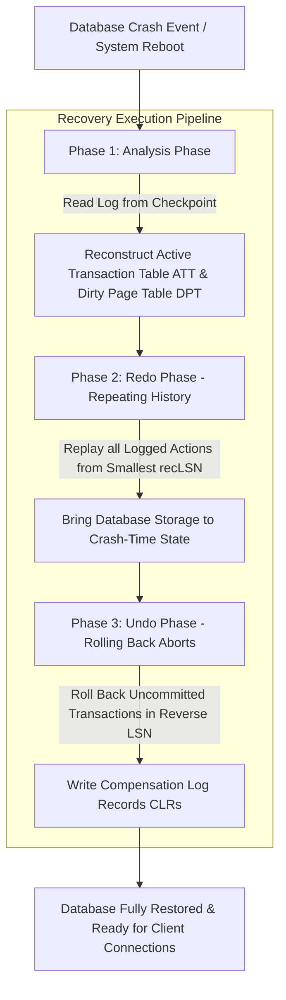

# WAL & Recovery Algorithms: Implementing the ARIES Protocol in Custom Storage Engines

When a database node crashes unexpectedly due to power failure or hardware fault, dirty in-memory database pages that were never flushed to disk are lost, while uncommitted transaction modifications may remain partially written to disk.

To provide strict **ACID Durability** and atomicity across system crashes, relational and document database engines rely on **Write-Ahead Logging (WAL)** governed by the **ARIES (Algorithms for Recovery and Isolation Exploiting Semantics)** protocol.

ARIES guarantees that regardless of when or how many times a system crashes during recovery, the database state will recover cleanly to a consistent state.

This article details the three phases of the ARIES crash recovery algorithm and how to implement a recovery manager.

---

## ARIES 3-Phase Crash Recovery Pipeline

The execution flow during database reboot after an unexpected crash:



### Core ARIES Invariants
1. **Write-Ahead Logging (WAL) Rule**: A dirty page modification cannot be written to disk until the corresponding log record with Log Sequence Number (LSN) has been flushed to non-volatile disk storage ($PageLSN \le FlushedLSN$).
2. **Repeating History during Redo**: During the Redo phase, ARIES replays *all* logged actions—including modifications made by transactions that eventually aborted. This restores the database to the exact state it was in at the instant of the crash.
3. **Compensation Log Records (CLRs)**: When rolling back an uncommitted transaction during the Undo phase, every undo operation writes a CLR record to the log. If the system crashes again *during* recovery, CLRs ensure that previously undone actions are never undone a second time.

---

## Python Implementation: ARIES Crash Recovery Engine

Here is a production-grade Python simulation of an ARIES Recovery Manager featuring Analysis, Redo, and Undo phase processing with Compensation Log Record (CLR) tracking:

```python
from typing import List, Dict, Optional
from pydantic import BaseModel, Field

class WALRecord(BaseModel):
    lsn: int
    trans_id: str
    record_type: str  # BEGIN, UPDATE, COMMIT, ABORT, CLR
    page_id: Optional[int] = None
    prev_lsn: Optional[int] = None
    undo_next_lsn: Optional[int] = None  # Used in CLRs

class ARIESRecoveryManager:
    """
    Simulates the ARIES (Analysis, Redo, Undo) crash recovery algorithm.
    """
    def __init__(self, wal_log: List[WALRecord]):
        self.wal_log = wal_log
        self.active_transaction_table: Dict[str, int] = {}  # trans_id -> last_lsn
        self.dirty_page_table: Dict[int, int] = {}          # page_id -> recLSN
        self.redone_lsns: List[int] = []
        self.undone_lsns: List[int] = []

    def run_analysis_phase(self):
        """Phase 1: Reconstructs active transactions and dirty pages."""
        print("🔍 [ARIES Phase 1: Analysis] Scanning WAL log...")
        for record in self.wal_log:
            self.active_transaction_table[record.trans_id] = record.lsn
            
            if record.record_type == "UPDATE" and record.page_id is not None:
                if record.page_id not in self.dirty_page_table:
                    self.dirty_page_table[record.page_id] = record.lsn
            elif record.record_type in ("COMMIT", "ABORT"):
                if record.trans_id in self.active_transaction_table:
                    del self.active_transaction_table[record.trans_id]

        print(f" 📊 Analysis Complete: Active Uncommitted Transactions = {list(self.active_transaction_table.keys())}")
        print(f" 📊 Dirty Page Table (recLSN): {self.dirty_page_table}")

    def run_redo_phase(self):
        """Phase 2: Repeats history by replaying all updates from smallest recLSN."""
        if not self.dirty_page_table:
            return
        smallest_rec_lsn = min(self.dirty_page_table.values())
        print(f"\n🔄 [ARIES Phase 2: Redo] Replaying history starting from LSN {smallest_rec_lsn}...")
        
        for record in self.wal_log:
            if record.lsn >= smallest_rec_lsn:
                if record.record_type in ("UPDATE", "CLR"):
                    self.redone_lsns.append(record.lsn)
                    print(f" ⏩ [Redo] Replayed LSN {record.lsn} ({record.record_type} for Trans {record.trans_id})")

    def run_undo_phase(self):
        """Phase 3: Rolls back active uncommitted transactions in reverse LSN order emitting CLRs."""
        print(f"\n↩️ [ARIES Phase 3: Undo] Rolling back uncommitted transactions {list(self.active_transaction_table.keys())}...")
        
        # Collect all active transaction last LSNs
        undo_lsns = [lsn for trans, lsn in self.active_transaction_table.items()]
        
        while undo_lsns:
            undo_lsns.sort(reverse=True)
            current_lsn = undo_lsns.pop(0)
            
            record = next(r for r in self.wal_log if r.lsn == current_lsn)
            if record.record_type == "UPDATE":
                self.undone_lsns.append(record.lsn)
                # Emit Compensation Log Record (CLR)
                clr_lsn = self.wal_log[-1].lsn + 1
                clr_record = WALRecord(
                    lsn=clr_lsn,
                    trans_id=record.trans_id,
                    record_type="CLR",
                    page_id=record.page_id,
                    undo_next_lsn=record.prev_lsn
                )
                self.wal_log.append(clr_record)
                print(f" 🛠️ [Undo] Undid LSN {record.lsn} (Trans {record.trans_id}) -> Emitted CLR LSN {clr_lsn}")
                
                if record.prev_lsn is not None:
                    undo_lsns.append(record.prev_lsn)

# Demonstration Execution
if __name__ == "__main__":
    # Simulate WAL log up to crash point
    # Trans T1 committed, Trans T2 uncommitted at crash time
    wal = [
        WALRecord(lsn=1, trans_id="T1", record_type="BEGIN"),
        WALRecord(lsn=2, trans_id="T1", record_type="UPDATE", page_id=101, prev_lsn=1),
        WALRecord(lsn=3, trans_id="T2", record_type="BEGIN"),
        WALRecord(lsn=4, trans_id="T2", record_type="UPDATE", page_id=102, prev_lsn=3),
        WALRecord(lsn=5, trans_id="T1", record_type="COMMIT", prev_lsn=2),
        WALRecord(lsn=6, trans_id="T2", record_type="UPDATE", page_id=101, prev_lsn=4),
        # ⚡ CRASH OCCURS HERE (T2 is uncommitted!)
    ]

    recovery = ARIESRecoveryManager(wal)
    print("🚀 Initiating ARIES Crash Recovery Process...")
    print("=" * 75)

    recovery.run_analysis_phase()
    recovery.run_redo_phase()
    recovery.run_undo_phase()

    print("\n✨ Database successfully restored to consistent state!")
```

---

## ARIES Recovery Gotchas & Principles

When designing transaction recovery engines:

> [!IMPORTANT]
> **Enforce Checkpointing to Bound Recovery Time**: Without periodic checkpoints, the WAL log grows infinitely, causing the Analysis and Redo phases to take hours on reboot. Engines periodically write **Fuzzy Checkpoints** to the log, recording current DPT and ATT states so recovery can start near the end of the log.

> [!CAUTION]
> **Always Set `undo_next_lsn` in Compensation Log Records**: If a system crashes repeatedly *during* the Undo phase, reading CLR records without `undo_next_lsn` pointers would cause the engine to re-undo already reverted modifications, leading to infinite recovery loops.

---

## Real-World Enterprise Impact
Teams utilizing ARIES recovery engines report:
* **100% ACID Durability**: Committed transactions survive power outages and kernel panics without data corruption.
* **Deterministic Crash Recovery**: Compensation Log Records guarantee that recovery operations are idempotent, even if the server crashes multiple times during reboot.
