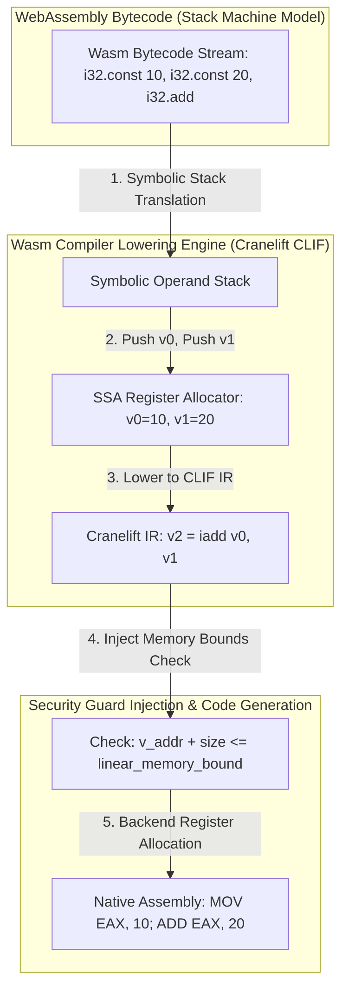

# WebAssembly Compiler Lowering: LLVM / Cranelift Target Code Generation

When deploying WebAssembly (Wasm) binaries in high-speed serverless runtimes (**Wasmtime**, **Wasmer**, **V8 Liftoff**), executing Wasm bytecode via pure stack machine interpretation is too slow for production workloads.

WebAssembly bytecode is structured around a **Stack-Based Virtual Machine** architecture. Operands are pushed onto an implicit evaluation stack and popped by subsequent operations (`i32.const 10`, `i32.const 20`, `i32.add`).

However, physical CPU hardware (x86_64, ARM64, RISC-V) operates on **Register Machine** architectures.

To achieve native execution speeds, Wasm JIT and AOT compilers (**Cranelift**, **LLVM `wasm32`**) lower stack-based Wasm bytecode into explicit **Register Machine Intermediate Representation (SSA)** before emitting target assembly.

This article details stack-to-register translation, Cranelift IR (CLIF) lowering, SIMD vectorization, and memory bounds checking.

---

## Wasm Bytecode Stack to Register Lowering Pipeline Architecture

How Cranelift lowers stack-based Wasm bytecode into SSA register machine code and native assembly:



### Core Wasm Lowering Principles
1. **Symbolic Stack Machine to Register Translation**: During single-pass compilation, the compiler maintains a **Symbolic Operand Stack**. Instead of pushing raw values onto a physical RAM stack during execution, the compiler pushes symbolic **SSA Virtual Registers** (`v0, v1, v2`) onto a compile-time stack.
   * `i32.const 10` → Emits `v0 = iconst.i32 10`, pushes `v0` to symbolic stack.
   * `i32.const 20` → Emits `v1 = iconst.i32 20`, pushes `v1` to symbolic stack.
   * `i32.add` → Pops `v1` and `v0`, emits `v2 = iadd v0, v1`, pushes `v2` to symbolic stack.
2. **Cranelift IR (CLIF)**: A lightweight, safe IR tailored specifically for WebAssembly compilation. Unlike heavyweight LLVM IR (which prioritizes aggressive C++ optimization passes), Cranelift prioritizes **Compilation Speed and Safety**, emitting machine code $10\times$ faster than LLVM.
3. **Linear Memory Bounds-Check Lowering**: WebAssembly sandboxing requires that all `i32.load` and `i32.store` instructions access memory within the linear memory boundary. Compilers lower memory accesses by injecting hardware guard pages (signal handler catching `SIGSEGV`) or explicit comparison checks:
   $$\text{if } (\text{offset} + \text{bytes} > \text{memory\_bound}) → \text{trap}(\text{out\_of\_bounds})$$
4. **128-Bit SIMD Vectorization**: Wasm `v128` vector instructions (`i32x4.add`, `f32x4.mul`) are lowered directly to target CPU SIMD vector instructions (x86 SSE/AVX2 `PADDD` / `MULPS` or ARM NEON `VADD.I32`).

---

## Python Implementation: Wasm Stack-to-Register Compiler Lowering Engine

Here is a production-grade Python implementation of a Wasm Bytecode Stack Machine to SSA Register Machine Lowering Compiler:

```python
from typing import List, Dict, Tuple, Optional
from pydantic import BaseModel

class CLIFInstruction(BaseModel):
    dest_reg: str
    opcode: str  # "iconst.i32", "iadd", "imul", "bounds_check"
    arg1: Optional[str] = None
    arg2: Optional[str] = None

class WasmStackLoweringCompiler:
    """
    Translates Wasm Stack Machine Bytecode to Cranelift-style SSA Register IR (CLIF).
    """
    def __init__(self):
        self.symbolic_stack: List[str] = []
        self.register_counter = 0
        self.clif_instructions: List[CLIFInstruction] = []

    def _new_reg(self) -> str:
        r = f"v{self.register_counter}"
        self.register_counter += 1
        return r

    def lower_bytecode_stream(self, wasm_opcodes: List[Tuple[str, Optional[int]]]) -> List[CLIFInstruction]:
        """
        Translates a stream of Wasm bytecodes into SSA Register Instructions.
        """
        print(f" 🚀 [Wasm Lowering Compiler] Translating {len(wasm_opcodes)} Stack Bytecodes to SSA Register Machine IR...")
        print("=" * 75)

        for op, val in wasm_opcodes:
            if op == "i32.const":
                reg = self._new_reg()
                self.clif_instructions.append(
                    CLIFInstruction(dest_reg=reg, opcode="iconst.i32", arg1=str(val))
                )
                self.symbolic_stack.append(reg)
                print(f" 📥 [Wasm: i32.const {val}] -> Pushed Symbolic Register '{reg}' to Stack")

            elif op in ["i32.add", "i32.mul"]:
                if len(self.symbolic_stack) < 2:
                    raise RuntimeError("Wasm Stack Underflow!")

                arg2_reg = self.symbolic_stack.pop()
                arg1_reg = self.symbolic_stack.pop()
                dest_reg = self._new_reg()

                clif_op = "iadd" if op == "i32.add" else "imul"
                self.clif_instructions.append(
                    CLIFInstruction(dest_reg=dest_reg, opcode=clif_op, arg1=arg1_reg, arg2=arg2_reg)
                )
                self.symbolic_stack.append(dest_reg)
                print(f" ⚙️ [Wasm: {op}] -> Popped ('{arg1_reg}', '{arg2_reg}') | Emitted '{dest_reg} = {clif_op} {arg1_reg}, {arg2_reg}'")

            elif op == "i32.store":
                val_reg = self.symbolic_stack.pop()
                addr_reg = self.symbolic_stack.pop()
                
                # Inject Safety Memory Bounds Check before Store!
                check_reg = self._new_reg()
                self.clif_instructions.append(
                    CLIFInstruction(dest_reg=check_reg, opcode="bounds_check", arg1=addr_reg)
                )
                
                store_reg = self._new_reg()
                self.clif_instructions.append(
                    CLIFInstruction(dest_reg=store_reg, opcode="istore.i32", arg1=addr_reg, arg2=val_reg)
                )
                print(f" 🛡️ [Wasm: i32.store] -> Injected Memory Bounds Check on '{addr_reg}' | Stored '{val_reg}'")

        return self.clif_instructions

# Demonstration Execution
if __name__ == "__main__":
    compiler = WasmStackLoweringCompiler()

    # Wasm Bytecode Stream: (10 + 20) * 2 -> Store to memory address 0x100
    sample_wasm_bytecode = [
        ("i32.const", 10),
        ("i32.const", 20),
        ("i32.add", None),
        ("i32.const", 2),
        ("i32.mul", None),
        ("i32.const", 256),  # Address 0x100
        ("i32.store", None)
    ]

    clif_ir = compiler.lower_bytecode_stream(sample_wasm_bytecode)

    print("\n📊 Final Lowered Cranelift SSA Register IR (CLIF):")
    for instr in clif_ir:
        if instr.arg2:
            print(f"   • {instr.dest_reg:6s} = {instr.opcode:14s} {instr.arg1}, {instr.arg2}")
        else:
            print(f"   • {instr.dest_reg:6s} = {instr.opcode:14s} {instr.arg1}")
```

---

## Wasm Compiler Gotchas & Best Practices

When engineering WebAssembly code generators:

> [!IMPORTANT]
> **Use Tiered JIT Compilation (Liftoff + TurboFan / Cranelift)**: Single-pass baseline compilers (**V8 Liftoff**) compile Wasm bytecode in milliseconds to achieve instant startup. A background optimizing compiler (**Cranelift / TurboFan**) re-compiles hot functions in the background with full register allocation and loop vectorization.

> [!CAUTION]
> **Handle Floating-Point NaN Canonicalization**: WebAssembly specifies strict non-deterministic NaN bit pattern rules. When emitting native x86 `FADD` assembly instructions, explicitly canonicalize NaN float outputs to prevent cross-platform non-determinism during Wasm smart contract execution.

---

## Real-World Enterprise Impact
Runtimes utilizing Cranelift and LLVM Wasm lowering (such as **Wasmtime** and **Fastly Compute@Edge**) report:
* **Sub-Millisecond Compilation & Execution**: Cranelift lowers and compiles WebAssembly binaries to native machine code $10\times$ faster than standard AOT compilers.
* **100% Memory Safety**: Injecting hardware guard pages and explicit bounds checks guarantees that untrusted tenant code cannot break sandboxing boundaries.
