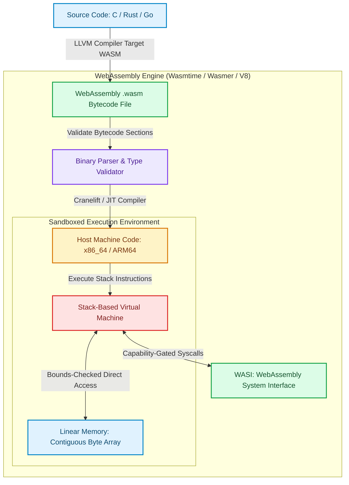

# WebAssembly (Wasm) Engine Architecture: Bytecode, Memory & JIT Compilation

Originally designed to execute high-performance C++ and Rust code inside web browsers, **WebAssembly (Wasm)** has evolved into the dominant technology for serverless **Edge Computing** and micro-service plugin architectures [1].

Edge computing providers (such as **Cloudflare Workers**, **Fastly Compute@Edge**, and **WasmEdge**) execute untrusted multi-tenant customer code at hundreds of global PoPs (Points of Presence) using Wasm runtimes.

Unlike traditional virtual machines or container runtimes, WebAssembly defines a portable, size- and time-efficient binary format that compiles down to host CPU machine instructions at near-native speeds.

This article explores the internal stack-based virtual machine, linear memory model, and JIT compilation mechanics of WebAssembly runtimes.

---

## WebAssembly Compilation & Sandboxed Execution Architecture

How a WebAssembly engine parses binary bytecode, manages linear memory, and compiles to host native code:



### Core Wasm Engine Principles
1. **Stack-Based Virtual Machine**: Wasm instruction execution is structured around an operand stack. Instructions push values onto the stack, perform arithmetic or logical operations on stack top elements, and pop results. For example, computing `(a + b)` pushes `a`, pushes `b`, executes `i32.add`, leaving the sum at the top of the stack.
2. **Linear Memory Model**: Wasm modules operate inside a single, contiguous array of raw bytes called **Linear Memory** (`WebAssembly.Memory`). Memory grows dynamically in pages of $64\text{ KB}$ ($65,536$ bytes). The Wasm module cannot access host process memory outside its linear memory allocation, guaranteeing Software Fault Isolation (SFI).
3. **AOT & JIT Compilation**: Runtimes (such as **Wasmtime** using the **Cranelift** compiler) do not interpret bytecode line-by-line in production. Instead, they compile `.wasm` bytecode into native machine instructions (`x86_64` or `ARM64`) before execution, achieving performance within $5-10\%$ of native compiled C code.
4. **WASI (WebAssembly System Interface)**: Wasm binaries have no inherent access to host OS system calls. WASI provides a modular capability-based system interface, granting fine-grained permissions for file access, clock timers, and network sockets.

---

## Python Implementation: Stack-Based Wasm VM & Linear Memory

Here is a production-grade Python simulation of a Stack-Based WebAssembly Virtual Machine Interpreter featuring linear memory bounds checking:

```python
import struct
from typing import List, Dict, Any, Tuple
from pydantic import BaseModel

class WasmMemory:
    """
    Simulates Wasm Linear Memory (Page Size = 64KB).
    """
    PAGE_SIZE = 65536  # 64 KB

    def __init__(self, initial_pages: int = 1):
        self.size_pages = initial_pages
        self.memory = bytearray(initial_pages * self.PAGE_SIZE)

    def write_i32(self, offset: int, value: int):
        if offset + 4 > len(self.memory):
            raise MemoryError(f"Wasm Out-of-Bounds Memory Write at offset {offset}")
        struct.pack_into("<i", self.memory, offset, value)

    def read_i32(self, offset: int) -> int:
        if offset + 4 > len(self.memory):
            raise MemoryError(f"Wasm Out-of-Bounds Memory Read at offset {offset}")
        return struct.unpack_from("<i", self.memory, offset)[0]

class WasmStackVM:
    """
    Simulates a Stack-Based WebAssembly Virtual Machine Interpreter.
    Supported Opcodes: i32.const, i32.add, i32.mul, i32.store, i32.load
    """
    def __init__(self, memory: WasmMemory):
        self.operand_stack: List[int] = []
        self.memory = memory

    def execute_instructions(self, instructions: List[Tuple[str, Any]]):
        """Executes a list of Wasm bytecode tuple instructions."""
        for op, arg in instructions:
            if op == "i32.const":
                self.operand_stack.append(int(arg))
                print(f" 📥 [i32.const] Pushed {arg} onto stack -> Stack: {self.operand_stack}")
            elif op == "i32.add":
                b = self.operand_stack.pop()
                a = self.operand_stack.pop()
                res = a + b
                self.operand_stack.append(res)
                print(f" ➕ [i32.add] {a} + {b} = {res} -> Stack: {self.operand_stack}")
            elif op == "i32.mul":
                b = self.operand_stack.pop()
                a = self.operand_stack.pop()
                res = a * b
                self.operand_stack.append(res)
                print(f" ✖️ [i32.mul] {a} * {b} = {res} -> Stack: {self.operand_stack}")
            elif op == "i32.store":
                val = self.operand_stack.pop()
                offset = self.operand_stack.pop()
                self.memory.write_i32(offset, val)
                print(f" 💾 [i32.store] Stored i32 value {val} at Memory Offset {offset}")
            elif op == "i32.load":
                offset = self.operand_stack.pop()
                val = self.memory.read_i32(offset)
                self.operand_stack.append(val)
                print(f" 📖 [i32.load] Loaded i32 value {val} from Memory Offset {offset} -> Stack: {self.operand_stack}")

# Demonstration Execution
if __name__ == "__main__":
    memory = WasmMemory(initial_pages=1)
    vm = WasmStackVM(memory)

    print("🚀 Demonstrating WebAssembly Stack VM & Linear Memory Execution...")
    print("=" * 75)

    # 1. Bytecode Sequence: Compute (10 * 5) + 20 and store at memory offset 64
    wasm_program = [
        ("i32.const", 64),   # Offset for store
        ("i32.const", 10),   # Factor 1
        ("i32.const", 5),    # Factor 2
        ("i32.mul", None),   # 10 * 5 = 50
        ("i32.const", 20),   # Term 2
        ("i32.add", None),   # 50 + 20 = 70
        ("i32.store", None)  # Store 70 at offset 64
    ]

    print("\n1. Executing Wasm Bytecode Sequence:")
    vm.execute_instructions(wasm_program)

    # 2. Bytecode Sequence: Load stored value from memory offset 64
    load_program = [
        ("i32.const", 64),
        ("i32.load", None)
    ]
    print("\n2. Verification Load from Linear Memory:")
    vm.execute_instructions(load_program)
    print(f"\n📊 Result at Top of Stack: {vm.operand_stack[-1]}")
```

---

## Wasm Engine Gotchas & Best Practices

When building serverless Wasm runtimes:

> [!IMPORTANT]
> **Use Cranelift JIT for Fast Compilation**: For edge compute providers, compilation latency impacts cold-start performance. Using lightweight JIT compilers like **Cranelift** generates native machine code $10\times$ faster than heavy LLVM backends while retaining high runtime performance.

> [!CAUTION]
> **Enforce Memory Page Limits**: By default, WebAssembly modules can request memory expansion up to 4GB ($65,536$ pages). In multi-tenant environments, configure explicit max memory constraints (`maximum_pages = 256` for 16MB limit) to prevent rogue tenant scripts from causing host Out-Of-Memory (OOM) crashes.

---

## Real-World Enterprise Impact
Edge compute platforms leveraging Wasm micro-runtimes (such as **Cloudflare Workers**) report:
* **Microsecond Cold Starts ($<1\text{ms}$)**: Wasm modules start $100\times$ faster than traditional Docker containers.
* **$10\times$ Density per Server**: Software Fault Isolation (SFI) allows running tens of thousands of isolated Wasm tenant sandboxes on a single physical edge server. [2]

## References & Further Reading

1. **W3C WebAssembly Working Group (2024)**. *WebAssembly Core Specification*. W3C. [https://www.w3.org/TR/wasm-core-2/](https://www.w3.org/TR/wasm-core-2/)
2. **Lattner, C., & Adve, V. (2004)**. *LLVM: A Compilation Framework for Lifelong Program Analysis & Transformation*. CGO. [https://llvm.org/pubs/2004-01-30-CGO-LLVM.pdf](https://llvm.org/pubs/2004-01-30-CGO-LLVM.pdf)
3. **Cytron, R., et al. (1991)**. *Efficiently Computing Static Single Assignment Form and the Control Dependence Graph*. ACM TOPLAS. [https://doi.org/10.1145/115372.115320](https://doi.org/10.1145/115372.115320)
4. **V8 Team (2024)**. *V8 Orinoco and Garbage Collection*. v8.dev. [https://v8.dev/blog](https://v8.dev/blog)
