# WebSockets in Production: Where SSE Ends and WS Begins

> [!NOTE]
> **📖 Article Overview**
> Server-Sent Events handle 90% of LLM streaming use cases perfectly. But when your architecture needs full-duplex communication — collaborative editing, live agent-to-agent coordination, multi-user whiteboards, or real-time tool call feedback — you need WebSockets. The problem is that WebSockets fail in production for entirely different reasons than SSE: Nginx upgrade header misconfiguration, heartbeat timer drift causing phantom disconnections, proxy timeouts on idle connections, message backpressure silently dropping data, and auth token expiry mid-session. This article maps the **8 WebSocket production failure modes** you'll hit, and provides complete fixes in **TypeScript (Hono/ws) and Python (FastAPI/websockets)**.

---

## SSE vs WebSockets: Choose the Right Tool

```mermaid
%%{init: {'theme': 'dark', 'themeVariables': { 'primaryColor': '#0ea5e9', 'primaryTextColor': '#f3f4f6', 'primaryBorderColor': '#38bdf8', 'lineColor': '#0ea5e9', 'secondaryColor': '#111827', 'tertiaryColor': '#0f172a'}}}%%
flowchart TD
    Q1{Does the client<br/>send messages<br/>after connection?} -->|No| SSE[✅ Use SSE<br/>Simpler, HTTP/2 multiplexed<br/>Auto-reconnect built in]
    Q1 -->|Yes| Q2{More than<br/>10 msg/sec<br/>in both directions?}
    Q2 -->|No| Q3{Need binary<br/>frames?}
    Q2 -->|Yes| WS[✅ Use WebSockets<br/>Full-duplex, lower overhead<br/>at high message rates]
    Q3 -->|Yes| WS
    Q3 -->|No| Q4{Collaborative<br/>multi-user<br/>real-time?}
    Q4 -->|Yes| WS
    Q4 -->|No| SSE

    style SSE fill:#052e16,stroke:#10b981,stroke-width:2px
    style WS fill:#0c1a3a,stroke:#3b82f6,stroke-width:2px
```



**Use SSE for**: LLM token streaming, one-way notifications, progress updates, server push
**Use WebSockets for**: Chat apps, collaborative editors, agent-to-user tool call feedback, live dashboards with bidirectional controls

---

## Failure 1: Nginx Doesn't Upgrade to WebSocket Protocol

**Symptom**: WebSocket handshake returns `400 Bad Request` or `101 Switching Protocols` never fires. Works on `localhost`, broken in production.

**Root cause**: WebSocket upgrades require specific HTTP headers that Nginx strips by default: `Connection: Upgrade` and `Upgrade: websocket`.

```nginx
# ❌ Standard proxy config — strips Upgrade headers
location /ws {
    proxy_pass http://localhost:3000;
}

# ✅ WebSocket-aware Nginx config
location /ws {
    proxy_pass http://localhost:3000;
    
    # Required for WebSocket upgrade
    proxy_http_version 1.1;
    proxy_set_header Upgrade $http_upgrade;
    proxy_set_header Connection "upgrade";
    
    # Prevent Nginx from closing idle WS connections
    proxy_read_timeout 3600s;
    proxy_send_timeout 3600s;
    
    # Forward real client IP
    proxy_set_header Host $host;
    proxy_set_header X-Real-IP $remote_addr;
    proxy_set_header X-Forwarded-For $proxy_add_x_forwarded_for;
}
```

---

## Failure 2: Phantom Disconnections from Idle Proxy Timeouts

**Symptom**: WebSocket connections drop exactly every 60 seconds during idle periods. Clients see `1006 Abnormal Closure`. Active connections (frequent messages) never drop.

**Root cause**: Load balancers and proxies (AWS ALB default: 60s, Nginx default: 60s) close idle TCP connections. A WebSocket connection with no messages for 60s looks "idle" and gets terminated.

**Fix — Implement heartbeat ping/pong:**

```typescript
// Server: Hono WebSocket with heartbeat
import { Hono } from 'hono';
import { upgradeWebSocket } from 'hono/cloudflare-workers';

const app = new Hono();

// Track active connections with their heartbeat timers
const connections = new Map<string, {
  ws: WebSocket;
  pingInterval: ReturnType<typeof setInterval>;
  isAlive: boolean;
}>();

app.get('/ws', upgradeWebSocket((c) => {
  const connId = crypto.randomUUID();

  return {
    onOpen(event, ws) {
      console.log(`[WS] Connected: ${connId}`);

      const conn = {
        ws: ws.raw as WebSocket,
        isAlive: true,
        pingInterval: setInterval(() => {
          if (!conn.isAlive) {
            // Client missed a pong — close the dead connection
            console.log(`[WS] ${connId} missed pong — terminating`);
            clearInterval(conn.pingInterval);
            connections.delete(connId);
            ws.close(1001, 'Heartbeat timeout');
            return;
          }
          conn.isAlive = false;
          ws.send(JSON.stringify({ type: 'ping', ts: Date.now() }));
        }, 25_000), // Ping every 25s — under the 60s ALB timeout
      };

      connections.set(connId, conn);
    },

    onMessage(event, ws) {
      const data = JSON.parse(event.data as string);

      // Reset heartbeat on pong
      if (data.type === 'pong') {
        const conn = connections.get(connId);
        if (conn) conn.isAlive = true;
        return;
      }

      // Handle real messages
      ws.send(JSON.stringify({ type: 'ack', received: data }));
    },

    onClose() {
      const conn = connections.get(connId);
      if (conn) clearInterval(conn.pingInterval);
      connections.delete(connId);
      console.log(`[WS] Disconnected: ${connId}`);
    },
  };
}));
```

```python
# FastAPI WebSocket with heartbeat
import asyncio
import json
from fastapi import FastAPI, WebSocket, WebSocketDisconnect

app = FastAPI()

HEARTBEAT_INTERVAL = 25  # seconds

@app.websocket("/ws")
async def websocket_endpoint(websocket: WebSocket):
    await websocket.accept()
    
    async def send_heartbeats():
        """Send periodic pings to prevent proxy idle timeout."""
        while True:
            try:
                await asyncio.sleep(HEARTBEAT_INTERVAL)
                await websocket.send_json({"type": "ping", "ts": asyncio.get_event_loop().time()})
            except Exception:
                break
    
    heartbeat_task = asyncio.create_task(send_heartbeats())
    
    try:
        while True:
            data = await websocket.receive_json()
            
            if data.get("type") == "pong":
                continue  # Heartbeat acknowledged
            
            # Process real message
            await websocket.send_json({"type": "ack", "echo": data})
            
    except WebSocketDisconnect:
        print("Client disconnected")
    finally:
        heartbeat_task.cancel()
```

---

## Failure 3: Auth Token Expiry Mid-Session

**Symptom**: User is connected for 2 hours. JWT expires. Next message returns `4001 Unauthorized`. User loses all session state and has to start over.

**Root cause**: JWTs passed during WebSocket handshake (via query param or cookie) are only validated once — at connection time. They're never re-checked mid-session. When they expire, the server has no mechanism to challenge the client.

```typescript
// ✅ Token refresh protocol over the WebSocket connection itself
// Client-side token refresh handler
class AuthenticatedWebSocket {
  private ws: WebSocket | null = null;
  private token: string;
  private refreshTimer: ReturnType<typeof setTimeout> | null = null;

  constructor(private url: string, initialToken: string) {
    this.token = initialToken;
  }

  connect() {
    this.ws = new WebSocket(`${this.url}?token=${this.token}`);

    this.ws.onmessage = (event) => {
      const msg = JSON.parse(event.data);

      // Server signals token is expiring soon
      if (msg.type === 'TOKEN_EXPIRING') {
        this.refreshToken();
        return;
      }

      // Server accepted refreshed token
      if (msg.type === 'TOKEN_REFRESHED') {
        this.token = msg.newToken;
        console.log('[WS Auth] Token refreshed successfully');
        return;
      }

      this.handleMessage(msg);
    };

    this.ws.onerror = () => {
      if (this.refreshTimer) clearTimeout(this.refreshTimer);
    };
  }

  private async refreshToken() {
    try {
      const response = await fetch('/api/auth/refresh', {
        method: 'POST',
        credentials: 'include',
      });
      const { token } = await response.json();
      
      // Send new token over existing WS connection
      this.ws?.send(JSON.stringify({ type: 'REFRESH_TOKEN', token }));
    } catch {
      // Refresh failed — reconnect with full auth
      this.ws?.close();
      window.location.href = '/login';
    }
  }

  private handleMessage(msg: unknown) {
    console.log('[WS] Message:', msg);
  }
}
```

---

## Failure 4: Message Backpressure — The Silent Data Drop

**Symptom**: Under high load, some WebSocket messages are never delivered. No errors. The server log shows messages sent, client log shows fewer received.

**Root cause**: WebSocket `send()` is not inherently backpressure-aware. If you send messages faster than the client can consume them, the outgoing buffer fills up and messages are silently dropped once `bufferedAmount` exceeds the limit.

```typescript
// ❌ No backpressure — silently drops messages under load
async function streamResults(ws: WebSocket, results: AsyncIterable<string>) {
  for await (const chunk of results) {
    ws.send(chunk); // What if client is slow to consume?
  }
}

// ✅ Backpressure-aware sender — waits for buffer to drain
const MAX_BUFFER_SIZE = 64 * 1024; // 64KB
const DRAIN_POLL_MS = 16;           // ~1 frame

async function backpressureSend(ws: WebSocket, data: string): Promise<void> {
  // Wait if the outgoing buffer is full
  while (ws.bufferedAmount > MAX_BUFFER_SIZE) {
    if (ws.readyState !== WebSocket.OPEN) return;
    await new Promise(r => setTimeout(r, DRAIN_POLL_MS));
  }
  if (ws.readyState === WebSocket.OPEN) {
    ws.send(data);
  }
}

async function streamResultsWithBackpressure(
  ws: WebSocket,
  results: AsyncIterable<string>
) {
  for await (const chunk of results) {
    await backpressureSend(ws, chunk);
    if (ws.readyState !== WebSocket.OPEN) break; // Stop if closed
  }
}
```

---

## Failure 5: Broadcasting to Many Clients Blocks the Event Loop

**Symptom**: You have 500 connected WebSocket clients. When you broadcast a message, the server freezes for 200ms while iterating through all connections.

```typescript
// ❌ Synchronous broadcast — blocks event loop for large connection sets
function broadcastAll(message: string) {
  for (const [id, conn] of connections) {
    conn.ws.send(message); // Synchronous — blocks on each send
  }
}

// ✅ Chunked async broadcast — yields to event loop between batches
async function broadcastChunked(message: string, chunkSize = 50) {
  const connList = Array.from(connections.values());
  
  for (let i = 0; i < connList.length; i += chunkSize) {
    const chunk = connList.slice(i, i + chunkSize);
    
    // Send to this chunk concurrently
    await Promise.allSettled(
      chunk.map(conn => {
        if (conn.ws.readyState === WebSocket.OPEN) {
          return backpressureSend(conn.ws, message);
        }
        return Promise.resolve();
      })
    );
    
    // Yield to event loop between chunks
    await new Promise(r => setImmediate(r));
  }
}
```

---

## Failure 6: Close Codes Mean Something — Don't Ignore Them

**Symptom**: Client reconnects strategy is too aggressive, causing reconnect storms on planned server maintenance.

```typescript
// ✅ Read the close code before deciding to reconnect
const ws = new WebSocket('/ws');

ws.onclose = (event) => {
  console.log(`[WS] Closed: code=${event.code} reason="${event.reason}"`);
  
  switch (event.code) {
    case 1000: // Normal closure
      console.log('[WS] Server closed cleanly — no reconnect needed');
      break;
    
    case 1001: // Going away (server restart/deploy)
      console.log('[WS] Server restarting — reconnect with backoff');
      reconnectWithBackoff();
      break;
    
    case 1006: // Abnormal closure (network loss, proxy timeout)
      console.log('[WS] Abnormal close — reconnect immediately');
      reconnectWithBackoff();
      break;
    
    case 4001: // Custom: Unauthorized
      console.log('[WS] Auth expired — redirect to login');
      window.location.href = '/login';
      break;
    
    case 4002: // Custom: Rate limited
      console.log('[WS] Rate limited — wait 30s before reconnect');
      setTimeout(connect, 30_000);
      break;
    
    default:
      console.log('[WS] Unknown close code — reconnect with backoff');
      reconnectWithBackoff();
  }
};

let retryCount = 0;
function reconnectWithBackoff() {
  const delay = Math.min(1000 * 2 ** retryCount + Math.random() * 500, 30_000);
  retryCount++;
  setTimeout(connect, delay);
}

function connect() {
  // ... establish new WebSocket
  retryCount = 0; // Reset on successful open
}
```

---

## Failure 7: No Room Cleanup — Memory Leak on Disconnect

**Symptom**: Server memory grows linearly with total historical connections. After 24 hours, memory usage is 3× baseline.

```python
# ❌ Connections added but never removed on disconnect
active_connections: dict[str, WebSocket] = {}

@app.websocket("/ws/{room_id}")
async def room_ws(websocket: WebSocket, room_id: str, client_id: str):
    await websocket.accept()
    active_connections[client_id] = websocket  # Added...
    
    try:
        while True:
            data = await websocket.receive_json()
            # ... handle message
    except WebSocketDisconnect:
        pass  # ← Disconnect caught but connection NEVER removed from dict!

# ✅ Always clean up on disconnect — use try/finally
class ConnectionManager:
    def __init__(self):
        self.rooms: dict[str, set[WebSocket]] = {}

    async def connect(self, room_id: str, websocket: WebSocket):
        await websocket.accept()
        if room_id not in self.rooms:
            self.rooms[room_id] = set()
        self.rooms[room_id].add(websocket)
        print(f"[WS] Room {room_id}: {len(self.rooms[room_id])} clients")

    def disconnect(self, room_id: str, websocket: WebSocket):
        self.rooms.get(room_id, set()).discard(websocket)
        if not self.rooms.get(room_id):
            del self.rooms[room_id]  # Remove empty rooms
        print(f"[WS] Room {room_id}: {len(self.rooms.get(room_id, set()))} clients")

    async def broadcast(self, room_id: str, message: dict):
        dead = set()
        for ws in self.rooms.get(room_id, set()):
            try:
                await ws.send_json(message)
            except Exception:
                dead.add(ws)
        for ws in dead:
            self.disconnect(room_id, ws)

manager = ConnectionManager()

@app.websocket("/ws/{room_id}")
async def room_endpoint(websocket: WebSocket, room_id: str):
    await manager.connect(room_id, websocket)
    try:
        while True:
            data = await websocket.receive_json()
            await manager.broadcast(room_id, {"echo": data})
    except WebSocketDisconnect:
        pass
    finally:
        manager.disconnect(room_id, websocket)  # ← Always runs
```

---

## Failure 8: AWS ALB / Cloudflare Don't Support WebSockets on All Plans

**Symptom**: WebSocket works behind Nginx but breaks on AWS ALB or Cloudflare proxy.

- **AWS ALB**: Supports WebSocket natively — but requires the target group protocol to be HTTP, not HTTPS. Ensure your EC2/ECS target accepts HTTP and the ALB handles TLS termination.
- **Cloudflare**: WebSocket requires **at minimum the Pro plan**. Free plan silently proxies as HTTP, breaking the Upgrade handshake.
- **Vercel**: WebSocket is **not supported** on serverless functions. Use Vercel's Edge Functions with Durable Objects, or an external WebSocket server (Ably, Pusher, or a dedicated WS host).

```typescript
// ✅ Detect WebSocket support before connecting — degrade to SSE gracefully
function createConnection(url: string, onMessage: (data: unknown) => void) {
  if ('WebSocket' in window && !forceSSE) {
    const ws = new WebSocket(url.replace('https://', 'wss://'));
    ws.onopen = () => console.log('[Connection] WebSocket established');
    ws.onmessage = (e) => onMessage(JSON.parse(e.data));
    ws.onerror = () => {
      console.warn('[Connection] WS failed — falling back to SSE');
      ws.close();
      useSSEFallback(url, onMessage);
    };
    return ws;
  }
  return useSSEFallback(url, onMessage);
}

function useSSEFallback(url: string, onMessage: (data: unknown) => void) {
  const source = new EventSource(url + '/stream');
  source.onmessage = (e) => onMessage(JSON.parse(e.data));
  return source;
}
```

---

## 🏁 Conclusion & Key Takeaways

WebSockets unlock true bidirectional real-time communication but bring a distinct set of production failure modes compared to SSE. The most dangerous are silent: dropped messages from buffer overflow, phantom disconnections from idle proxies, and memory leaks from missing disconnect cleanup.

- **Always implement heartbeats at 25-second intervals** — most proxies and load balancers have 60-second idle timeouts. Heartbeats keep connections alive and detect dead clients.
- **Read close codes and act accordingly** — `1000` means don't reconnect; `1006` means reconnect immediately; `4001` means re-authenticate. Ignoring close codes leads to unnecessary reconnect storms.
- **Clean up in `finally` blocks** — every WebSocket `connect` must have a corresponding `disconnect` in a `finally` clause, or you will leak memory with every closed connection.

---

### Research References & Resources
- **MDN WebSocket API**: [WebSocket close codes reference](https://developer.mozilla.org/en-US/docs/Web/API/CloseEvent/code)
- **RFC 6455**: [The WebSocket Protocol specification](https://datatracker.ietf.org/doc/html/rfc6455)
- **FastAPI WebSockets**: [WebSocket documentation](https://fastapi.tiangolo.com/advanced/websockets/)
