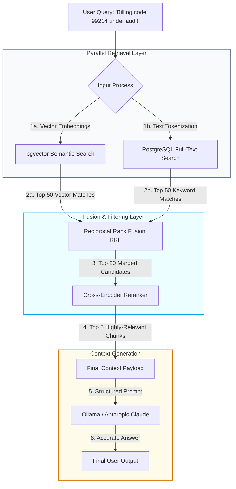

> ### 📖 Article Overview
> * **What this article is about:** This article explains how to build a production-ready RAG pipeline by combining semantic vector search (`pgvector`) and lexical keyword search (PostgreSQL `tsvector`) with Reciprocal Rank Fusion (RRF) and Cross-Encoder reranking.
> * **Why it matters:** Moving beyond simple vector similarity prevents production failures caused by short, keyword-dense queries or long, noisy contexts, significantly improving retrieval accuracy and LLM response quality.
> * **What we synthesized:** We demonstrated how to implement a complete hybrid search and reranking pipeline directly within PostgreSQL, avoiding the operational complexity of external vector databases while maintaining high performance.

The standard tutorial for Retrieval-Augmented Generation (RAG) is deceptively simple: chunk a few text files, generate vector embeddings, throw them into a vector database, and perform a Cosine Similarity search on the user's query.

When you deploy this setup to production, however, it quickly falls apart.

Users write short, keyword-dense search queries ("2024 billing code 99214") that semantic vector models struggle to rank correctly. Or they write long, complex comparative queries that retrieve irrelevant chunks, flooding the LLM context window with noise.

To build production-ready RAG, we must move beyond pure vector similarity and build a **Hybrid Retrieval and Reranking Pipeline**.

This article details how to integrate semantic vector search (`pgvector`) with lexical keyword search (PostgreSQL `tsvector`), merge results using Reciprocal Rank Fusion (RRF), and apply a Cross-Encoder Reranker, as modeled in my repository [healthcare-audit-vault](https://github.com/akmalkhaniub/healthcare-audit-vault).

---

## The Hybrid Retrieval & Reranking Pipeline

Rather than relying on a single retrieval method, our pipeline queries the database in parallel using two separate search mechanisms, merges the results mathematically, and sorts them using a deep learning classifier before sending the context to the LLM.



1. **Parallel Queries**: The query is embedded (e.g., via `text-embedding-3-small`) to search vector indices, while simultaneously being parsed into a lexeme query for text search.
2. **Reciprocal Rank Fusion (RRF)**: RRF assigns a score to each document based on its relative rank in both searches, balancing semantic matches with exact keyword matches.
3. **Cross-Encoder Reranking**: Vector search evaluates document representations independently (Bi-Encoder). We feed the top 20 candidate documents alongside the query into a **Cross-Encoder model** (like `bge-reranker-large`). The Cross-Encoder performs deep attention-level comparison, scoring the exact relevance of each document chunk.
4. **LLM Context Ingestion**: The top 5 reranked documents are injected into the prompt.

---

## Building a Hybrid Search Engine in PostgreSQL

By keeping both vectors and text inside **PostgreSQL**, we avoid the operational complexity of running separate vector databases (like Pinecone or Milvus) alongside our application DB.

Here is the SQL schema and the hybrid search query, utilizing `pgvector` and native Postgres text search tools:

### 1. Database Table Definition
```sql
-- Enable the pgvector extension
CREATE EXTENSION IF NOT EXISTS vector;

CREATE TABLE document_chunks (
    id UUID PRIMARY KEY DEFAULT gen_random_uuid(),
    document_id UUID REFERENCES medical_documents(id) ON DELETE CASCADE,
    content TEXT NOT NULL,
    content_vector vector(1536), -- Dimension for OpenAI/Gemma embeddings
    content_tsv tsvector -- Full-text search lexemes
);

-- Index vector column for fast Approximate Nearest Neighbor (ANN) search
CREATE INDEX document_chunks_vector_idx ON document_chunks 
USING hnsw (content_vector vector_cosine_ops);

-- Index the text lexeme column for fast keyword matches
CREATE INDEX document_chunks_tsv_idx ON document_chunks USING gin(content_tsv);
```

### 2. Hybrid RRF Search Query
This query implements Reciprocal Rank Fusion directly in SQL, retrieving and combining the top ranks from semantic similarity and lexical search:

```sql
WITH vector_search AS (
    SELECT id, ROW_NUMBER() OVER (ORDER BY content_vector <=> $1) as rank
    FROM document_chunks
    ORDER BY content_vector <=> $1
    LIMIT 50
),
text_search AS (
    SELECT id, ROW_NUMBER() OVER (ORDER BY ts_rank_cd(content_tsv, to_tsquery('english', $2)) DESC) as rank
    FROM document_chunks
    WHERE content_tsv @@ to_tsquery('english', $2)
    ORDER BY ts_rank_cd(content_tsv, to_tsquery('english', $2)) DESC
    LIMIT 50
)
SELECT 
    chunks.id, 
    chunks.content,
    COALESCE(1.0 / (60 + vs.rank), 0.0) + COALESCE(1.0 / (60 + ts.rank), 0.0) as rrf_score
FROM document_chunks chunks
LEFT JOIN vector_search vs ON chunks.id = vs.id
LEFT JOIN text_search ts ON chunks.id = ts.id
WHERE vs.id IS NOT NULL OR ts.id IS NOT NULL
ORDER BY rrf_score DESC
LIMIT 20;
```
*Note: The constant `60` in the RRF math prevents high-ranking matches from completely dominating the score, allowing lower ranks to contribute fairly.*

---

## RAG Ingestion Guardrails

* **Chunking Strategies**: Never chunk text arbitrarily by character count. Use semantic layout-aware chunking (splitting on headings, tables, or markdown structural breaks) to keep related context blocks whole.
* **Metadata Tagging**: Annotate chunks with metadata tags (e.g., `facility_id`, `audit_year`, `billing_code`). Restrict searches using SQL `WHERE` clauses (e.g., `WHERE facility_id = X`) *before* executing vector matches to narrow the search space.
* **Lost-in-the-Middle Mitigation**: LLM context windows suffer from recall degradation in the middle of long prompts. Always place the most critical retrieved chunks at the very beginning and very end of your context window.

---

## Conclusion & Key Takeaways

Transitioning from basic vector search to a hybrid retrieval and reranking pipeline is essential for deploying robust, production-grade RAG systems.
1. **Hybrid Search Combines Strengths:** Merging semantic vector search with lexical keyword search ensures the system handles both conceptual queries and exact keyword matches effectively.
2. **PostgreSQL Simplifies Architecture:** Using `pgvector` and native full-text search within a single PostgreSQL database eliminates the overhead of managing separate vector databases.
3. **Reranking Filters Noise:** Applying a Cross-Encoder reranker after Reciprocal Rank Fusion (RRF) ensures only the most contextually relevant chunks reach the LLM, mitigating "lost-in-the-middle" issues.

*Takeaway:* *Production-ready RAG requires a multi-layered retrieval strategy that balances semantic depth, keyword precision, and deep-learning reranking.*

---

## References & Further Reading

* **RRF Scoring**: *Reciprocal Rank Fusion outperforms Single-Representation Information Retrieval*. Foundation paper showing why rank-based aggregation beats score-based aggregation.
* **Cross-Encoder Reranking**: *Bi-Encoders vs. Cross-Encoders for Semantic Search*. Details the computational trade-offs and accuracy improvements of rerankers. [arXiv:2010.11929](https://arxiv.org/abs/2010.11929)

*To inspect our clinical database schemas and pgvector integration details, check out the source code of our [healthcare-audit-vault](https://github.com/akmalkhaniub/healthcare-audit-vault) repository.*