> ### 📖 Article Overview
> * **What this article is about:** This article clarifies the distinctions between LLM workflows, single-agent loops, and multi-agent systems to establish a clear spectrum of autonomy.
> * **Why it matters:** Failing to choose the correct architecture leads to over-engineered, slow, expensive, and difficult-to-verify AI systems.
> * **What we synthesized:** We synthesized a decision matrix and architectural guardrails to help developers select the most efficient and predictable design pattern for their tasks.

In the rush to adopt generative artificial intelligence, vocabulary has been the first casualty. Marketing decks call simple API wrappers "agents," and developers refer to basic loops as "multi-agent networks." 

This lack of terminological precision isn't just a semantic issue; it is a design hazard. When developers fail to distinguish between workflows, agents, and multi-agent systems, they build architectures that are over-engineered, slow, expensive, and difficult to verify.

To design production-grade systems, we must map our tasks against a clear **Spectrum of Autonomy**.

---

## The Three Tiers of AI Systems

To build reliable systems, we must choose the right architectural pattern based on the complexity and predictability of the target workflow.

```mermaid
graph TD
    subgraph Workflow [1. Deterministic / LLM Workflow]
        W_Start[Input] --> W_Step1[Step A: Prompt]
        W_Step1 --> W_Step2[Step B: Code Logic]
        W_Step2 --> W_Step3[Step C: Prompt]
        W_Step3 --> W_Out[Predictable Output]
    end

    subgraph Agent [2. Single Agent Loop]
        A_Start[Input] --> A_Loop{ReAct Loop}
        A_Loop -->|Decide Tool| A_Tool[Call API / Tool]
        A_Tool -->|Observe Result| A_Loop
        A_Loop -->|Task Finished| A_Out[Output]
    end

    subgraph MAS [3. Multi-Agent System]
        M_Start[Input] --> M_Orch[Orchestrator Agent]
        M_Orch -->|Delegates| M_W1[Worker Agent A]
        M_Orch -->|Delegates| M_W2[Worker Agent B]
        M_W1 --> M_Val[Validator Agent]
        M_W2 --> M_Val
        M_Val -->|Approved| M_Out[Final Output]
        M_Val -->|Rejected| M_Orch
    end

    style Workflow fill:#f8fafc,stroke:#cbd5e1,stroke-width:2px
    style Agent fill:#f0f9ff,stroke:#0ea5e9,stroke-width:2px
    style MAS fill:#f0fdf4,stroke:#22c55e,stroke-width:2px
```



### 1. LLM Workflows (Structured Pipelines)
Workflows are systems where the execution sequence is defined entirely by application code. The LLM is used as a processor at specific nodes (e.g., summarizing text or extracting variables), but it has no control over the execution graph.
*   **Prompt Chaining**: Serial execution where Step A generates data for Step B.
*   **Deterministic Routing**: A classifier LLM determines which route to take, but the downstream paths themselves are hard-coded.
*   **Why they succeed**: Highly predictable, fast, easy to test, and cheap to run.

### 2. Single Agents (Autonomous Tool Loops)
An agent is an LLM running within a loop where the model decides its own execution path. The model is given a goal, a set of tools (functions), and a loop wrapper (such as the ReAct framework).
*   **Mechanism**: The model output is parsed to identify a tool name and tool arguments. The application executes the tool, returns the result as an "observation" to the LLM's context, and the model determines the next move.
*   **Why they fail**: The loop is non-deterministic. If a tool returns unexpected output, the model can enter an infinite loop, hallucinate parameters, or drift from the original user goal.

### 3. Multi-Agent Systems (Decoupled Collaborations)
A multi-agent system divides a complex problem space into separate agent nodes, each running specialized loops. Instead of sharing a single context window, these agents maintain private state files and communicate through structured handoff contracts.
*   **Mechanism**: A supervisor or orchestrator decomposes the user query, assigns sub-tasks to worker agents, and collects their outputs. A separate validator agent evaluates the final state before termination.
*   **Why they are necessary**: When a task is too complex for a single context window, dividing labor prevents cognitive overload and tool list dilution.

---

## 🚦 The Decision Matrix: When to Keep It Simple

Before building a multi-agent system, walk through this decision path to avoid over-engineering:

```
                  Is the execution path predictable?
                             /          \
                           YES           NO
                           /              \
            [Use LLM Workflow]      Does it require multiple specialists?
                                            /           \
                                          YES            NO
                                          /               \
                            [Use Multi-Agent System]   [Use Single Agent]
```

### Build a Workflow If:
1.  The inputs and outputs of each step have a known schema.
2.  A human operator can write a step-by-step checklist of how to perform the task.
3.  The task must comply with strict legal, regulatory, or business protocols (e.g., invoicing, medical intakes).

### Build a Single Agent If:
1.  The sequence of steps is highly variable, but the interaction is conversational (e.g., a support agent finding customer details by calling search APIs).
2.  The model needs to run a trial-and-error execution loop (e.g., executing read-only database queries to locate a record).

### Build a Multi-Agent System If:
1.  The task requires distinct personas that would conflict in a single prompt (e.g., a creative writer agent and a critique/security agent).
2.  The number of tool schemas required exceeds the context attention span of a single model (typically >4 tools).
3.  You need parallel execution of complex tasks (e.g., compiling code modules concurrently).

---

## 📋 The Architecture Guardrails Checklist

*   [ ] **Autonomy Audit**: Do you have a programmatic escape hatch to break infinite agent loops after a set number of iterations (e.g., max 5 turns)?
*   [ ] **Routing Review**: Can your router LLM be replaced by a regex, string match, or semantic vector distance check to save tokens and latency?
*   [ ] **State Sanity Check**: Are you persisting agent state at every step using database-backed checkpointers (e.g., Postgres JSONB)?

---

## 🏁 Conclusion & Key Takeaways

Navigating the spectrum of AI autonomy requires balancing flexibility with predictability to build production-grade systems.
1. **Match Complexity to Architecture:** Do not default to complex multi-agent systems when a deterministic LLM workflow or a single-agent loop can achieve the same result faster and cheaper.
2. **Enforce Strict Guardrails:** Always implement programmatic escape hatches, state persistence, and cost-effective routing to prevent runaway agent loops and high latency.
3. **Design for Predictability:** Keep execution paths as deterministic as possible, reserving autonomous agent loops only for highly variable tasks that require trial-and-error.

*Takeaway:* Build the simplest system possible that reliably solves the problem, reserving high autonomy only for tasks that truly demand it.

---

## 📚 References & Further Reading

*   **LangGraph Conceptual Docs**: *Workflows vs. Agents*. Discusses the precise boundaries between application control and model control. [Link](https://langchain-ai.github.io/langgraph/concepts/agentic_concepts/)
*   **Microsoft AutoGen Framework**: *Introduction to Multi-Agent Conversation*. Explains the foundations of actor-based messaging structures. [Link](https://microsoft.github.io/autogen/docs/Use-Cases/agent_chat/)
*   **Research Paper**: Wang et al., 2023. *A Survey on Large Language Model based Autonomous Agents*. A review of single-agent and multi-agent paradigms. [arXiv:2308.11432](https://arxiv.org/abs/2308.11432)

*To explore complete code implementations of all 17 agent microservices in a single monorepo, check out the public [agentic-apps-portfolio](https://github.com/akmalkhaniub/agentic-apps-portfolio) repository.*