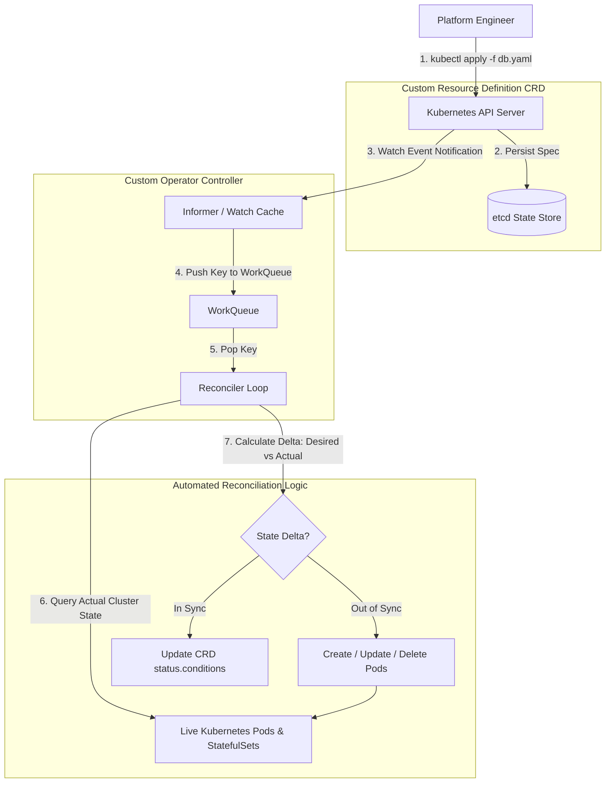

# Writing Kubernetes Operators: Custom Resource Definitions (CRDs) & Reconciler Loops

Kubernetes is built on a powerful extensibility model. Out of the box, it manages built-in primitives like `Pods`, `Deployments`, and `Services`. However, stateful applications—such as PostgreSQL database clusters, Redis sentinel pairs, or Kafka brokers—require complex operational knowledge to scale, backup, failover, and upgrade.

To encode human operational domain knowledge directly into the Kubernetes API, platform engineers write **Kubernetes Operators**.

An Operator pairs a **Custom Resource Definition (CRD)** (which extends the Kubernetes API schema) with a custom **Reconciler Controller Loop**.

The Reconciler continuously observes the actual state of the cluster, compares it against the user's declared desired state, and takes automated corrective actions to converge the two.

This article details how to design and build a custom Kubernetes Operator Reconciler.

---

## Kubernetes Operator Control Loop Architecture

How a Custom Controller watches CRD events and drives cluster convergence:



### Core Operator Components
1. **Custom Resource Definition (CRD)**: Defines a custom OpenAPI schema registered with the Kubernetes API server (e.g. `apiVersion: database.example.com/v1`, `kind: PostgresCluster`).
2. **Informer & WorkQueue**: Instead of polling the API server, the controller establishes a HTTP streaming watch using Informers. Informers cache resource states locally and push modified resource keys into a thread-safe `WorkQueue`.
3. **Reconciler Loop (`Reconcile`)**: The core control function. Given a resource key (e.g., `default/my-postgres-cluster`), the Reconciler fetches the current `Spec` from etcd, inspects live child resources, and executes idempotent API calls until actual state matches desired state.

---

## Python Implementation: Custom Kubernetes Operator Reconciler

Here is a production-grade Python simulation of a Kubernetes Custom Resource Reconciler Engine that manages a stateful database cluster:

```python
import time
import asyncio
from typing import Dict, Any, List, Optional
from pydantic import BaseModel, Field

class PostgresClusterSpec(BaseModel):
    replicas: int = Field(..., ge=1, le=10)
    version: str = "15.2"
    storage_gb: int = 50

class PostgresClusterStatus(BaseModel):
    current_replicas: int = 0
    phase: str = "Pending"  # Pending, Running, Reconciling, Failed
    ready_nodes: List[str] = Field(default_factory=list)

class CustomResource(BaseModel):
    api_version: str = "database.example.com/v1"
    kind: str = "PostgresCluster"
    name: str
    namespace: str = "default"
    spec: PostgresClusterSpec
    status: PostgresClusterStatus = Field(default_factory=PostgresClusterStatus)

class SimulatedKubernetesCluster:
    """Simulates live Kubernetes cluster state (StatefulSets & Pods)."""
    def __init__(self):
        # pod_name -> status
        self.live_pods: Dict[str, str] = {}

    def get_pods_for_cluster(self, cluster_name: str) -> List[str]:
        return [pod for pod in self.live_pods.keys() if pod.startswith(cluster_name)]

    def create_pod(self, pod_name: str):
        self.live_pods[pod_name] = "Running"
        print(f"   ⚙️ [Kubernetes API] Created Pod '{pod_name}' (Status: Running)")

    def delete_pod(self, pod_name: str):
        if pod_name in self.live_pods:
            del self.live_pods[pod_name]
            print(f"   🗑️ [Kubernetes API] Deleted Pod '{pod_name}'")

class OperatorReconciler:
    """
    Custom Operator Reconciler Loop driving actual cluster state to match CRD spec.
    """
    def __init__(self, k8s_cluster: SimulatedKubernetesCluster):
        self.k8s = k8s_cluster

    def reconcile(self, crd: CustomResource) -> PostgresClusterStatus:
        print(f"\n🔄 [Reconciler Loop] Reconciling '{crd.namespace}/{crd.name}'...")
        desired_replicas = crd.spec.replicas
        
        # 1. Inspect Actual State
        existing_pods = self.k8s.get_pods_for_cluster(crd.name)
        actual_count = len(existing_pods)
        print(f"   📊 State Comparison: Desired Replicas={desired_replicas} | Actual Live Pods={actual_count}")

        # 2. Reconcile Delta: Scale Up
        if actual_count < desired_replicas:
            diff = desired_replicas - actual_count
            print(f"   ➕ Scaling UP by +{diff} pods...")
            for i in range(actual_count, desired_replicas):
                pod_name = f"{crd.name}-node-{i}"
                self.k8s.create_pod(pod_name)

        # 3. Reconcile Delta: Scale Down
        elif actual_count > desired_replicas:
            diff = actual_count - desired_replicas
            print(f"   ➖ Scaling DOWN by -{diff} pods...")
            for i in range(desired_replicas, actual_count):
                pod_name = f"{crd.name}-node-{i}"
                self.k8s.delete_pod(pod_name)

        # 4. Update Status Conditions
        live_nodes = self.k8s.get_pods_for_cluster(crd.name)
        new_status = PostgresClusterStatus(
            current_replicas=len(live_nodes),
            phase="Running" if len(live_nodes) == desired_replicas else "Reconciling",
            ready_nodes=live_nodes
        )
        print(f"   ✅ Reconciliation Complete. CRD Status -> Phase: '{new_status.phase}' ({new_status.current_replicas} Ready Nodes)")
        return new_status

# Demonstration Execution
if __name__ == "__main__":
    k8s = SimulatedKubernetesCluster()
    reconciler = OperatorReconciler(k8s)

    print("🚀 Demonstrating Custom Kubernetes Operator Reconciler...")
    print("=" * 75)

    # 1. Apply CRD Spec: Request 3 Replicas
    crd_instance = CustomResource(
        name="prod-db",
        spec=PostgresClusterSpec(replicas=3, version="15.2")
    )

    # Initial Reconciliation (Creates 3 Pods)
    crd_instance.status = reconciler.reconcile(crd_instance)

    # 2. User Updates Spec: Scale to 5 Replicas
    print("\n⚡ User executes 'kubectl apply' updating spec.replicas = 5...")
    crd_instance.spec.replicas = 5
    crd_instance.status = reconciler.reconcile(crd_instance)

    # 3. Out-of-Band Incident: Manual Pod Deletion (Simulates node crash)
    print("\n🚨 Out-of-Band Event: Node crash deletes 'prod-db-node-4'...")
    k8s.delete_pod("prod-db-node-4")

    # Operator Reconciles and Self-Heals Cluster!
    crd_instance.status = reconciler.reconcile(crd_instance)
```

---

## Operator Gotchas & Best Practices

When engineering Kubernetes Operators:

> [!IMPORTANT]
> **Make Reconciler Loops Strictly Idempotent**: A Reconciler function may be invoked dozens of times for the same event due to network retries or status updates. Ensure that calling `Reconcile()` repeatedly with unchanged specifications produces identical cluster states without creating duplicate resources.

> [!CAUTION]
> **Separate `Spec` from `Status` Updates**: In the Kubernetes API, modifying `crd.spec` is reserved for users declaring desired state, while the Operator controller updates `crd.status`. Updating `spec` inside an Operator creates infinite event trigger loops.

---

## Real-World Enterprise Impact
Teams writing custom Kubernetes Operators report:
* **Automated Self-Healing Operations**: Operators detect drifted or crashed stateful nodes and automatically provision replacements without human intervention.
* **Declarative API Standardization**: Managing complex database or messaging middleware using familiar `kubectl` declarative YAML files streamlines platform engineering workflows.
