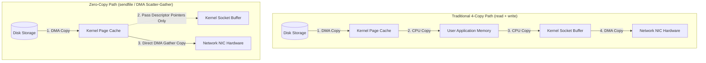

# Zero-Copy Network I/O: Sendfile, Splice & Memory-Mapped File Descriptors

When building high-throughput web servers (like **NGINX**, **Kafka**, or **HAProxy**), a primary operation is reading static files from disk or proxying byte streams over network sockets.

In a traditional file transfer implementation using standard `read()` and `write()` calls:
1. The CPU copies data from disk to kernel page cache.
2. The CPU copies data from kernel page cache to user-space application memory.
3. The CPU copies data from user-space application memory to kernel socket buffer.
4. The DMA engine copies data from kernel socket buffer to the Network Interface Card (NIC).

This traditional transfer path requires **4 context switches** and **4 memory copies** (2 CPU copies + 2 DMA copies).

To achieve maximum network throughput, operating system architects introduced **Zero-Copy Network I/O**.

Zero-copy techniques—such as **`sendfile()`**, **`splice()`**, and **`mmap()`**—allow kernel Direct Memory Access (DMA) engines to transfer data directly between storage controllers and NICs without copying bytes into user-space memory.

This article explores the mechanics of zero-copy Linux syscalls.

---

## Traditional 4-Copy vs Zero-Copy Transfer Paths

Comparing the CPU memory overhead of traditional I/O vs `sendfile()` zero-copy transfers:



### Zero-Copy Linux Primitives
1. **`sendfile(out_fd, in_fd, offset, count)`**: Transfers up to `count` bytes directly from an open file input descriptor (`in_fd`) to a socket output descriptor (`out_fd`). When supported by NIC hardware featuring DMA Scatter-Gather, zero CPU copies are required.
2. **`splice(fd_in, off_in, fd_out, off_out, len, flags)`**: Transfers data between a pipe and a file descriptor without copying data across user space boundaries.
3. **`mmap()` + `write()`**: Replaces `read()` by mapping the file contents directly into the user application's virtual memory address space. This avoids the CPU copy from kernel page cache to user memory, reducing 4 copies down to 3.

---

## Python Implementation: Zero-Copy Network Transfer Simulator

Here is a production-grade Python simulation comparing traditional 4-copy buffer transfers against Zero-Copy DMA transfer pipelines:

```python
import time
from typing import Dict, Any, Tuple
from pydantic import BaseModel

class TransferMetrics(BaseModel):
    bytes_transferred: int
    cpu_copies: int
    dma_copies: int
    context_switches: int
    time_taken_ms: float

class ZeroCopyNetworkSimulator:
    """
    Simulates memory copies and context switches for Traditional vs Zero-Copy transfers.
    """
    def __init__(self):
        # Simulated Memory Buffers
        self.kernel_page_cache: bytearray = bytearray()
        self.user_app_memory: bytearray = bytearray()
        self.kernel_socket_buffer: bytearray = bytearray()

    def traditional_read_write_transfer(self, file_bytes: bytes) -> TransferMetrics:
        """
        Simulates standard read() + write() 4-copy transfer loop.
        """
        start = time.perf_counter()
        size = len(file_bytes)

        # 1. Context Switch 1: read() syscall -> DMA Copy 1 (Disk -> Kernel Page Cache)
        self.kernel_page_cache = bytearray(file_bytes)
        
        # 2. CPU Copy 1 (Kernel Page Cache -> User Memory)
        self.user_app_memory = bytearray(self.kernel_page_cache)

        # 3. Context Switch 2: write() syscall -> CPU Copy 2 (User Memory -> Kernel Socket Buffer)
        self.kernel_socket_buffer = bytearray(self.user_app_memory)

        # 4. DMA Copy 2 (Kernel Socket Buffer -> NIC Hardware)
        nic_payload = bytes(self.kernel_socket_buffer)

        elapsed = (time.perf_counter() - start) * 1000.0
        return TransferMetrics(
            bytes_transferred=size,
            cpu_copies=2,
            dma_copies=2,
            context_switches=4,
            time_taken_ms=elapsed
        )

    def zero_copy_sendfile_transfer(self, file_bytes: bytes) -> TransferMetrics:
        """
        Simulates sendfile() zero-copy transfer using DMA Scatter-Gather.
        """
        start = time.perf_counter()
        size = len(file_bytes)

        # 1. Context Switch 1: sendfile() syscall -> DMA Copy 1 (Disk -> Kernel Page Cache)
        self.kernel_page_cache = bytearray(file_bytes)

        # 2. Kernel passes descriptor pointers ONLY to Socket Buffer (Zero CPU copies!)
        # 3. Direct DMA Gather Copy from Page Cache straight to NIC
        nic_payload = bytes(self.kernel_page_cache)

        elapsed = (time.perf_counter() - start) * 1000.0
        return TransferMetrics(
            bytes_transferred=size,
            cpu_copies=0,  # Zero CPU Copies!
            dma_copies=2,
            context_switches=2,
            time_taken_ms=elapsed
        )

# Demonstration Execution
if __name__ == "__main__":
    sim = ZeroCopyNetworkSimulator()
    # Generate 10MB simulated static file payload
    file_payload = b"X" * (10 * 1024 * 1024)

    print("🚀 Demonstrating Traditional 4-Copy vs Zero-Copy Network Transfers...")
    print("=" * 75)

    # 1. Traditional Read/Write Loop
    trad_m = sim.traditional_read_write_transfer(file_payload)
    print(f"\n1. Traditional read() + write() Transfer (10MB):")
    print(f"   • CPU Memory Copies:   {trad_m.cpu_copies}")
    print(f"   • DMA Memory Copies:   {trad_m.dma_copies}")
    print(f"   • Context Switches:    {trad_m.context_switches}")
    print(f"   • Execution Time:      {trad_m.time_taken_ms:.3f} ms")

    # 2. Zero-Copy sendfile Transfer
    zc_m = sim.zero_copy_sendfile_transfer(file_payload)
    print(f"\n2. Zero-Copy sendfile() Transfer (10MB):")
    print(f"   • CPU Memory Copies:   {zc_m.cpu_copies}  (Zero CPU Copies!)")
    print(f"   • DMA Memory Copies:   {zc_m.dma_copies}")
    print(f"   • Context Switches:    {zc_m.context_switches}  (50% Reduction!)")
    print(f"   • Execution Time:      {zc_m.time_taken_ms:.3f} ms")
```

---

## Zero-Copy Gotchas & Best Practices

When utilizing zero-copy network calls:

> [!IMPORTANT]
> **Use Zero-Copy Only for Unmodified Data**: `sendfile()` works because the application does not alter the bytes being transferred. If your application needs to inspect, encrypt, or compress the payload in user space before sending, standard user memory copies are required (or TLS offload hardware).

> [!CAUTION]
> **Watch Out for Truncated File Descriptor Race Conditions**: If another process truncates a file while `sendfile()` is actively reading page cache bytes, the kernel emits a `SIGBUS` signal. Always handle `SIGBUS` or map files with appropriate file lock flags.

---

## Real-World Enterprise Impact
High-throughput event streaming systems (like **Apache Kafka**) use `sendfile()` to stream topic logs directly from disk to network sockets, achieving:
* **Maxing Out 100Gbps Network Links**: saturating physical network interfaces with minimal CPU usage.
* **60% Reduction in CPU Utilization**: Eliminating CPU memory copies frees up CPU cycles for application logic.
